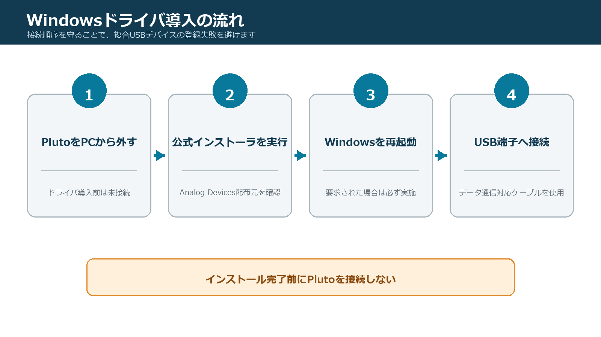
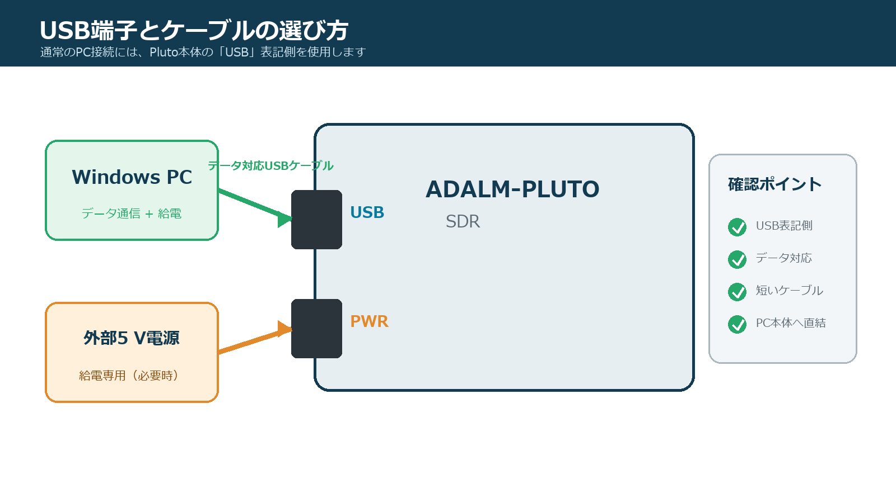
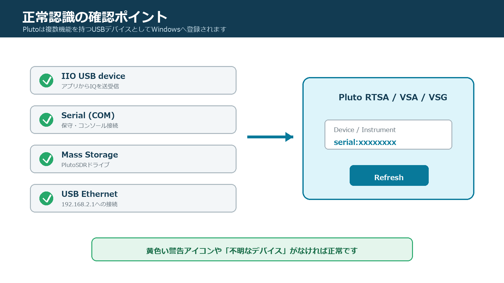

# ADALM-Pluto Windowsドライバ インストールガイド

文書版: 1.0
対象: Pluto RTSA / Pluto VSA / Pluto VSG 共通

## 1. はじめに

本書は、Windows PCでADALM-Pluto（PlutoSDR）を使用するためのUSBドライバ導入手順です。Pluto RTSA、Pluto VSA、Pluto VSGを初めて使用する前に実施してください。

本アプリのWindows portable版には動作に必要なlibiio runtimeが同梱されています。通常はAnalog DevicesのPlutoSDR USBドライバだけを別途インストールすれば使用できます。`iio_info`などのコマンドラインツールを利用する場合に限り、libiio本体を別途導入してください。

本書は2026年9月14日時点の公式情報を基にしています。インストーラの最新版と対応OSは、実行前にAnalog Devicesの公開ページで確認してください。

## 2. 対象環境と準備

本書ではWindows 10 / Windows 11の64-bit環境を主対象とします。Analog Devicesの公式ページではWindows 11、10、8.1、8、Windows 7 SP1がサポート対象として案内されています。

準備するもの:

- ADALM-Pluto本体
- データ通信対応USBケーブル
- USB 2.0以上のPC側ポート
- ドライバをインストールできるWindows管理者権限
- Pluto RTSA / VSA / VSGのportable package

> ドライバのインストールが完了するまでPlutoをPCへ接続しないでください。Analog Devicesは、接続したままインストーラを実行するとドライバファイルの導入に失敗する場合があると案内しています。



## 3. 公式ドライバを入手する

1. Webブラウザで[Analog Devices公式WindowsドライバRelease](https://github.com/analogdevicesinc/plutosdr-m2k-drivers-win/releases/latest)を開きます。
2. 最新ReleaseのAssetsから`PlutoSDR-M2k-USB-Drivers.exe`をダウンロードします。
3. ダウンロード元が`github.com/analogdevicesinc/plutosdr-m2k-drivers-win`であることを確認します。
4. ファイルのプロパティを開き、意図したインストーラであることを確認します。

2026年9月14日時点の最新Releaseはv0.9です。固定バージョンが必要な場合は[v0.9 Release](https://github.com/analogdevicesinc/plutosdr-m2k-drivers-win/releases/tag/v0.9)を使用できますが、通常は`latest`ページから最新版を取得してください。

## 4. ドライバをインストールする

1. PlutoがPCから外れていることを確認します。
2. `PlutoSDR-M2k-USB-Drivers.exe`をダブルクリックします。
3. Windowsのユーザーアカウント制御が表示されたら、内容を確認して許可します。
4. セットアップウィザードの案内に従ってインストールを進めます。
5. 複数のデバイスドライバ導入確認が表示された場合は、Analog Devicesのドライバであることを確認して続行します。
6. 完了画面を確認してセットアップを終了します。
7. 再起動を求められた場合はWindowsを再起動します。

インストール中にPlutoを接続したり、USBケーブルを抜き差ししたりしないでください。

## 5. Plutoを接続する

PlutoのUSBコネクタには用途の違いがあります。通常のPC接続には、本体中央寄りのデータ通信用USBコネクタを使用します。側面寄りの電源用コネクタだけでは、通常のUSBデータ接続はできません。



1. データ通信用USBコネクタとPCを接続します。
2. Windowsがデバイスを構成するまで待ちます。初回は数十秒かかる場合があります。
3. エクスプローラーに`PlutoSDR`ドライブが表示されることを確認します。
4. ドライブ内の`info.html`を開けることを確認します。

USBハブ、延長ケーブル、充電専用ケーブルは認識不良の原因になります。問題がある場合は、短いデータ通信対応ケーブルでPC本体のUSBポートへ直接接続してください。

## 6. デバイスマネージャーで確認する

1. スタートボタンを右クリックし、**デバイス マネージャー**を開きます。
2. Pluto接続後に次の機能が認識されていることを確認します。

| 機能 | 確認内容 |
|---|---|
| IIO USB device | PlutoSDR / ADALM-Plutoに相当するUSBデバイスが存在する |
| Serial | Plutoのシリアルコンソールに相当するCOMポートが存在する |
| Mass Storage | エクスプローラーにPlutoSDRドライブが表示される |
| USB Ethernet | PlutoのUSBネットワークアダプタが存在する |

Windowsやドライバの版によって表示名と分類は異なります。重要なのは、Plutoに関連するデバイスへ黄色い警告アイコンや「不明なデバイス」表示がないことです。



## 7. Plutoアプリで認識を確認する

1. Plutoを接続した状態で、RTSA、VSA、VSGのいずれか1つだけを起動します。
2. DeviceまたはInstrument Settingsを開きます。
3. Refreshを実行します。
4. `serial:...`または`usb:...`でPlutoが一覧に表示されることを確認します。
5. 対象Plutoを選択し、アプリのタイトルバーにRXまたはTX識別情報が表示されることを確認します。

同じPlutoを複数のアプリから同時に使用することはできません。`Device busy`になる場合は、別のRTSA、VSA、VSG、IIO Oscilloscope、MATLAB、GNU Radioなどを終了してください。

## 8. コマンドラインで確認する（任意）

libiio toolsを別途インストールしている場合は、コマンドプロンプトで次を実行できます。

```text
iio_info -s
```

正常時は、利用可能なcontextとして次のようなPlutoが表示されます。

```text
Analog Devices Inc. PlutoSDR (ADALM-PLUTO), serial=... [usb:...]
```

さらに特定URIを確認する場合は、`iio_info -u usb:...`を使用します。USB URIは接続し直すと変化する場合があるため、本アプリでは保存可能な場合にserial selectorを優先してください。

## 9. 更新・再インストール・アンインストール

### 9.1 更新または再インストール

1. RTSA、VSA、VSGおよびPlutoを使用する他のアプリを終了します。
2. PlutoをPCから外します。
3. 最新の公式インストーラを実行します。
4. 完了後にPlutoを再接続して認識を確認します。

### 9.2 アンインストール

1. PlutoをPCから外します。
2. Windowsの「設定 > アプリ > インストールされているアプリ」、または「コントロール パネル > プログラムと機能」を開きます。
3. `PlutoSDR-M2k-USB-Win-Drivers`に相当する項目を選択してアンインストールします。
4. 必要に応じてWindowsを再起動します。

Analog Devicesの公式手順では、このパッケージを削除するとUSB serial、WinUSB、network関連のWindows Driver Packageも削除されます。

## 10. トラブルシューティング

| 症状 | 確認と対処 |
|---|---|
| PlutoSDRドライブもデバイスも表示されない | データ対応ケーブル、PC直結、別USBポート、給電状態を確認 |
| ドライブは見えるがアプリに表示されない | ドライバをPluto未接続の状態で再インストールし、Windowsを再起動 |
| 黄色い警告アイコンがある | 対象デバイスを確認後、公式ドライバを再インストール |
| `Device busy` | Plutoを使用している他アプリを終了し、USBを再接続 |
| `iio_info -s`に表示されない | libiio toolsとUSB backend、ドライバ、ケーブルを確認 |
| USB接続が不安定 | USBハブを避け、短いケーブルとPC本体ポートを使用 |
| DFU deviceとして表示される | 通常ドライバの問題とは分け、公式Firmware Recovery手順を確認 |
| Network接続だけ見えない | USB network adapter、Windows firewall、`192.168.2.1`への経路を確認 |

改善しない場合は、次の順序で再確認します。

1. Plutoを外す。
2. ドライバをアンインストールする。
3. Windowsを再起動する。
4. 最新公式ドライバを再インストールする。
5. Windowsを再起動する。
6. PlutoをPC本体のUSBポートへ直接接続する。
7. デバイスマネージャーとアプリのRefreshで確認する。

## 11. ドライバとFirmwareの違い

WindowsドライバはPC側でPlutoのUSB機能を認識するためのソフトウェアです。FirmwareはPluto本体で動作するソフトウェアです。ドライバの再インストールとFirmware updateは別の作業です。

PlutoがDFU modeとしてのみ認識される場合やFirmware更新に失敗した場合は、[Analog Devices公式Firmware Update手順](https://wiki.analog.com/university/tools/pluto/users/firmware)を参照してください。通常のドライバ導入だけを目的として、Firmwareを書き換える必要はありません。

## 12. 公式資料

- [Analog Devices: Windows Drivers](https://wiki.analog.com/university/tools/pluto/drivers/windows)
- [Analog Devices: Pluto Driver Installation](https://analogdevicesinc.github.io/documentation/solutions/platforms/pluto/get-started/drivers.html)
- [Analog Devices: PlutoSDR Quick Start](https://wiki.analog.com/university/tools/pluto/users/quick_start)
- [Analog Devices GitHub: PlutoSDR/M2k Windows USB Drivers](https://github.com/analogdevicesinc/plutosdr-m2k-drivers-win/releases/latest)
- [libiio Installation](https://analogdevicesinc.github.io/libiio/main/install.html)
- [ADALM-Pluto Troubleshooting](https://wiki.analog.com/university/tools/pluto/troubleshooting)
