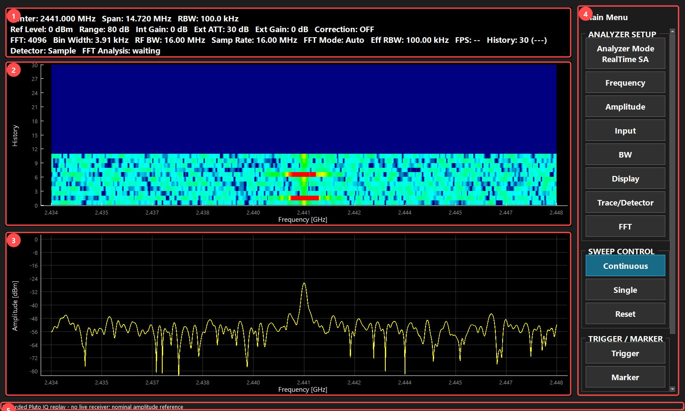
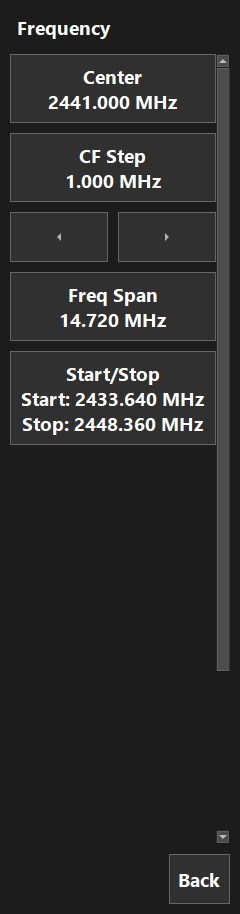

# Pluto RTSA ユーザーマニュアル

文書版: 2.1（2026-09-24 現行仕様との整合を確認）

対象: Pluto RTSA / 現行の操作・設定・レイアウト仕様に対応

## 1. 本書の使い方

Pluto RTSAはADALM-Plutoの受信IQをスペクトラム、ウォーターフォール、時間波形で観測します。最初は第3章の手順を試し、個々の設定は第4章以降で確認してください。ボタン名は英語画面と同じ表記です。操作パネル下部が見えない場合はスクロールします。`Back`またはパネル上の右クリックで前のページへ戻ります。

図は現在のアプリを動かして撮影しています。全体画面は保存済みPluto受信IQを開発用の再生経路で描画した例です。RTSAの通常メニューにIQファイル読込機能があるという意味ではありません。今回の図版作成で新たな実機測定は行っていません。出典は[図版・確認記録](manual-validation.md)に記載します。

## 2. 起動と画面

1. Plutoを接続し、`Pluto_RTSA.bat`を起動します。
2. 複数のPlutoがある場合は使用する個体を選択します。タイトルの`RX`表示を確認します。
3. 起動時には前回のモードと設定を復元し、取得を開始します。接続先の変更は`Device`です。

| 番号 | 領域 | 確認する内容 |
|---|---|---|
| 1 | 状態表示 | Center、Span、RBW、Gain、Detector、FFT条件 |
| 2 | Waterfall | 周波数ごとの時間変化。断続信号や時間で変わる帯域 |
| 3 | Spectrum / Time Trace | 通常は周波数対電力、HighSpeed TAでは時間対電力 |
| 4 | 操作パネル | 測定設定、実行、Marker、State、Device |
| 5 | ステータスバー | 取得状況、観測ギャップ、エラー |

前回のウィンドウ位置・サイズを復元します。最小サイズは960×640です。ペインの移動・別窓化はできません。分割比率は再起動すると初期値へ戻り、リサイズ時には再均等化しません。測定モードやGraph Viewの保存は継続します。

## 3. 画面を使った測定手順

### 3.1 周波数とレベルを確認する

1. `Analyzer Mode > RealTime SA`を選びます。
2. `Frequency > Center`に対象周波数、`Freq Span`に観測幅を入力します。図1のように信号の山が表示帯域内へ入るよう設定します。
3. `Input > Int Gain`を設定します。外部アッテネータの減衰量は`Ext ATT`へ入力します。
4. `Amplitude > Ref Level`と`Range`で山とノイズ床が見える縦軸にします。縦軸変更では受信飽和は解消しません。
5. `BW > RBW`で分解能を決め、`Continuous`で更新します。
6. `Marker > Marker 1`でONにし、対象Traceを選び、`Peak Search`を押して周波数とレベルを読みます。
7. 静止して読む場合は取得を停止します。`Single`は1回分の更新後に停止します。

### 3.2 断続信号を探す

`Display > Graph View`でSpectrumとWaterfallを表示し、`History`で履歴行数を調整します。`Trace/Detector`で1本をLive、別の1本をMax Holdにすると、現在値と過去最大値を比較できます。条件変更後は`Reset`で古い蓄積を消してください。Max Holdに山が残っていても、現在送信中とは限りません。

### 3.3 バーストの時間波形を測る

1. `Analyzer Mode > HighSpeed TA`へ切り替え、CenterとRBWを設定します。
2. `Sweep > Swp Time`で時間幅、`Swp Pts`で表示点数を指定します。
3. `Trigger > Source`を電力トリガにし、`Level`をノイズ床より高く、信号より低い位置に設定します。
4. `Slope`と`Position`を設定します。立ち上がり前も見る場合はPositionでプリトリガ領域を確保します。
5. `Single`を押します。待ち続ける場合はSource、Level、信号の有無を見直します。

## 4. Analyzer Mode

| 項目 | 内容と使い分け |
|---|---|
| RealTime SA | 1つの受信帯域を連続観測。FFT解析窓で評価できた時間範囲も状態表示で確認 |
| WideBand RT SA | 複数の周波数チャンクを順に取得して結合。全帯域を同時刻に受信する方式ではない |
| Sweep SA | 周波数点を順次切り替えて測定。広い帯域の定常信号を確認 |
| HighSpeed TA | 連続IQから測定帯域の電力対時間を表示。バースト幅・繰返し・トリガ観測に使用 |
| Calibration | 既知の基準入力と比較し、周波数別振幅補正を作成 |

旧Time Analyzerは通常のモード選択には表示しません。モードにより使用可能な設定が変わります。

## 5. Frequency・Amplitude・Input

| ページ / 項目 | 意味・単位・操作結果 |
|---|---|
| Frequency / Center | 観測中心周波数、MHz。モード間で共有 |
| CF Step | Center増減ボタン1回分の移動量、MHz。Spanは変更しない |
| Freq Span | 表示する周波数幅。対象周辺を拡大するときは狭める。受信条件も再構成される場合がある |
| Start/Stop | 開始・終了周波数で範囲を指定。Center/Spanと同じ範囲を別の方法で入力 |
| Chunk Width | WideBand RT SAの1回の取得帯域幅。分割数とチャンクの条件を決める |
| Amplitude / Ref Level | 電力軸上端の基準値、dBm。表示の縦位置を変更 |
| Range | 縦軸全体の表示幅、dB。小さい差を読みたいときは狭める |
| Input / Int Gain | Pluto内部受信利得、dB。大きすぎると飽和し、小さすぎると弱い信号が見えにくい |
| Ext ATT | 外部減衰量、dB。表示を減衰器の手前の基準面へ補正 |
| Ext Gain | 外部増幅器の利得、dB。表示から外部増幅分を差し引く |

入力系補正は`Ext ATT - Int Gain - Ext Gain`です。これに校正オフセット等を適用します。校正条件が不明なデータを絶対電力の基準にしないでください。

## 6. BW・FFT・Sweep

| ページ / 項目 | 個別説明 |
|---|---|
| BW / RBW | 分解能帯域幅、Hz。近接信号の分離と通過雑音量を変える。狭くすると必要解析時間・処理量が増える |
| VBW | 現行版は未実装の案内を表示。平滑化が適用されたものとして扱わない |
| FFT / FFT Parameters / Auto | 現在の帯域・RBWに応じてFFT条件を自動調整 |
| FFT Parameters / Advanced | 手動のFFT size選択へ進む。時間カバレッジやギャップも確認 |
| FFT size | 64〜16384の2のべき乗から選択。大きいほど周波数点数・計算量が増える。RBWそのものとは別の値 |
| Sweep / Swp Time | Sweep SAやHighSpeed TAの時間条件。画面の単位と対象モードを確認 |
| Swp Pts | 掃引または時間軸の評価点数。点数増加は表示密度と処理量に影響 |

変更後は状態表示の実際の条件を確認します。FFT sizeを大きくするだけではサンプル欠落や観測の空白は解消されません。

## 7. Trace・Detector・Display

### 7.1 Trace 1〜4

各Traceを独立に設定します。

| 項目 | 個別説明 |
|---|---|
| Trace ON/OFF | 選択Traceの表示切替 |
| Type / Live | 最新値で更新 |
| Type / Average | 複数回を平均して変動を抑える。急変への追従は遅くなる |
| Type / Max Hold | 各位置の最大値を保持。断続信号のピーク探索に使用 |
| Hold | そのTraceの更新を止め、比較用に固定 |
| Average Count | 平均回数。増やすと平滑化するが収束に時間がかかる |

### 7.2 Detector

| 項目 | 個別説明 |
|---|---|
| Sample | 評価区間の代表サンプル |
| Peak | 評価区間内の最大電力。短いピークを残す |
| Negative Peak | 最小電力 |
| Average | 評価区間の線形電力を算術平均 |
| RMS | 入力が既に二乗振幅のため、現行実装ではAverageと同じ線形電力平均。dB値の直接平均ではない |

Detectorは1回の評価区間の代表値、Trace Typeは複数回の蓄積方法を決めます。

### 7.3 Display

| 項目 | 個別説明 |
|---|---|
| Graph View | Spectrum、Waterfall、または両方を選択 |
| History | Waterfallの履歴行数。増やすと長い履歴を見られるがメモリ使用量も増加 |
| Persistence ON/OFF | スペクトラムの出現履歴を色で重ねる。対応モードで使用 |
| Persistence Decay / Fast | 過去の表示を速く減衰させる |
| Medium | 標準の減衰速度 |
| Slow | 過去を長く残し、まれな信号を確認 |

## 8. Trigger・Marker

### 8.1 HighSpeed TAのTrigger

| 項目 | 個別説明 |
|---|---|
| Source | Free Runまたは電力トリガ。Free Runは条件を待たず取得 |
| Mode | Normalは条件を待つ。Autoは待ち時間超過でも更新 |
| Level | トリガ閾値、dBm。入力補正の条件と合わせる |
| Slope | Rising / Falling / Either。閾値を横切る向き |
| Position | レコード内のトリガ位置、%。大きくするとトリガ前の領域が増える |
| Auto Timeout | Autoで条件成立を待つ時間。Normalの待ち時間制限ではない |

このTrigger操作はHighSpeed TAに対応します。他のモードのTriggerボタンに同じ動作を期待しないでください。

### 8.2 Marker 1〜4

| 項目 | 個別説明 |
|---|---|
| ON/OFF | マーカー表示切替 |
| Trace | 読み取るTraceを選択。LiveとMax Holdでは同じ位置でも値が異なる場合がある |
| Frequency | 読み取る周波数 |
| Step | 左右移動量 |
| Peak Search | 選択Traceのピークへ1回移動 |
| Continuous Peak | 更新ごとにピークへ追従 |
| Mkr->CF | マーカー周波数をCenterへ反映 |

## 9. Calibration

`Analyzer Mode > Calibration`で校正操作へ進みます。基準信号と配線の条件を揃えます。

| 項目 | 個別説明 |
|---|---|
| Calibrate | 基準測定のページへ進む |
| Load Reference CSV | 基準周波数・電力を読む。列は`frequency_hz,reference_power_dbm` |
| Measure | 基準に沿って測定。実行中・再試行・結果待ちに応じ表示が変わる |
| Return | 校正操作から戻る。測定中は操作できない場合がある |
| Load Correction CSV | 補正を読む。必要列は`frequency_hz,calibration_offset_db` |
| Correction ON/OFF | 周波数別補正の適用切替 |
| 結果CSV保存 | 測定後に周波数、実測電力、基準電力、補正量を保存 |

保存した結果は補正テーブルへ反映します。起動時は最後の補正CSVの再読込を試み、ファイル不在・読込失敗なら補正OFFで起動します。基準CSV、補正CSV、結果CSVのフォルダ履歴は別々です。

## 10. 実行・保存・再起動

| 操作 | 意味 |
|---|---|
| Continuous | 停止操作まで連続測定 |
| Single | 現在モードの1回分を取得して停止 |
| Reset | 測定蓄積を初期化。既定設定への復帰ではない |
| State > Save | `.rtsastate.json`へ設定状態を保存 |
| State > Recall | 設定状態を復元。測定IQの再生ではない |
| State > Preset | 確認後、設定を既定値へ戻す。選択中の機器は維持 |
| Device | 使用するPlutoの変更 |

主要設定はモードごとに復元し、Centerを共有します。測定IQ、Waterfall履歴、Average/Max Hold蓄積、掃引途中の位置は再起動時に復元しません。State保存・読込はフォルダ履歴を共有し、再起動後も保持します。キャンセルでは更新せず、フォルダがなくなった場合は既定フォルダへ戻ります。

## 11. 困ったとき

| 症状 | 確認する順序 |
|---|---|
| 信号が見えない | 対象Pluto → 配線 → Center/Span → Gain → Ref Level/Range |
| 電力が合わない | 飽和 → Ext ATT/Gain → Int Gain → Correctionと校正条件 |
| ピークが消えない | Max HoldやHoldを確認しReset |
| 更新が遅い | RBW、FFT size、Span、Historyの過大設定を見直す |
| 観測ギャップ警告 | 更新の滑らかさだけで判断せず、時間カバレッジと欠落を確認 |
| Singleが終わらない | Normalトリガで条件成立を待っていないか確認 |
| Device busy | 同じPlutoを保持する別アプリを終了。測定停止だけでは接続を解放しない場合がある |

DSPの詳細は[RBW処理](../verification/rtsa/rbw-processing.md)、各モードの技術資料は[資料一覧](../README.md)を参照してください。
