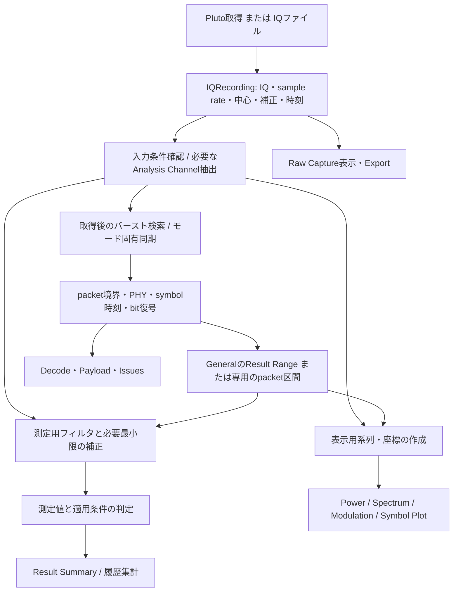
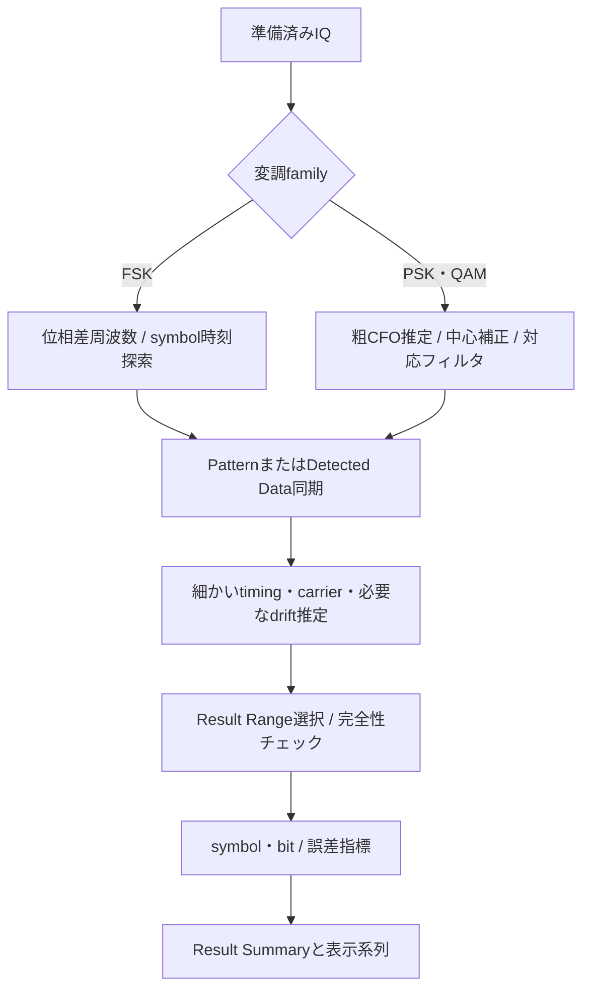
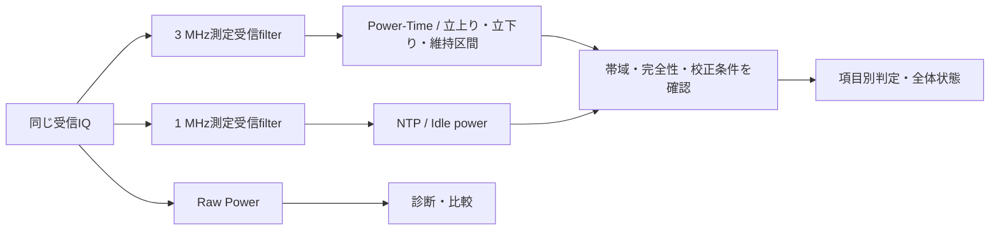

# Pluto VSA 解析フロー・アルゴリズム補足

文書版: 1.0 レビュー版（2026-09-23）

対象: General VSA / Bluetooth / DECT / Wi-Fi / ADS-B 1090ES

アプリ仕様の確認基準: `b43f7e6`

## 1. 本資料の範囲

Wi-Fi追補: Non-HTのSTF検出、LTF同期、CFO、channel等化、pilot補正、独立復号とEVMの定義は
[Wi-Fi現行仕様](../spec/vsa/wifi/non-ht-analyzer.md)と[方式・検証報告](../verification/vsa/wifi/non-ht-review.md)を参照してください。
Wi-Fiでは時間IQをPSK軌跡として扱わず、FFT後のsubcarrierを測定します。

本資料は現在の実装がIQから何を計算し、画面へどう出すかを説明します。操作は[VSAユーザーマニュアル](Pluto_VSA_User_Manual_JA.md)を参照してください。規格原文の代替や、全測定項目の適合認証を宣言する資料ではありません。規格に対応する計算処理と、実際に判定できる入力条件を分けて記述します。

読み進める際は次の3つを区別してください。

| 処理 | 目的 | 結果を見る場所 |
|---|---|---|
| 同期・復号 | packet境界、PHY、symbol、bit列を求める | Pattern診断、Decode、CRC/HEC、Issues |
| RF測定 | 定義された区間・フィルタ・補正条件で変調品質や電力を測る | Result SummaryのRF PHY Measurements |
| 表示加工 | 描画点数、密度、座標、基準値を調整 | Power、Modulation、Symbol Plot等 |

復号のために強い補正をかけたIQをそのままRF測定へ渡すと、測るべき送信誤差まで取り除く可能性があります。専用モードでは測定用の経路を設けています。

## 2. 全体フローとデータの基準



### 2.1 IQRecording

複素IQに加え、sample rate、RF中心、使用可能帯域、full scale、振幅補正、開始sample番号、trigger位置、不連続情報を保持します。配列は解析途中で元データが書き換わらないよう扱います。

- 時刻は概ね`開始sample番号 / sample rate + 局所sample番号 / sample rate`で決まります。
- 解析で間引く場合はsample rateと座標も変換します。元のsample番号をそのまま新しいrateで割ると時刻を誤ります。
- IQに欠落がある場合、連続位相を前提とする周波数・EVM等を正常データと同じ条件で解釈できません。
- dBm換算情報と`amplitude_calibrated`は別です。数値をdBmへ換算できても、絶対電力の規格判定に必要な校正を満たすとは限りません。

実装参照: [model.py](../../pluto_vsa/model.py)、[session.py](../../pluto_vsa/session.py)。

### 2.2 3種類の帯域を区別する

| 名称 | 作用する場所 | 設定の意味 |
|---|---|---|
| RF Bandwidth | Plutoの受信器 | 取り込むRF帯域。取得後には失われた信号を復元できない |
| Analysis Bandwidth | 共通デジタルチャネル抽出 | 対象中心へDDCし、LPFと必要な間引きで隣接波を除く |
| Measurement Filter | モード・測定項目ごとのRF評価 | BR/LE、EDR、DECT電力等の測定系列を作る |

## 3. Analysis Channel・DC・電力

### 3.1 DDCとLPF

取得中心を`f_capture`、選択中心を`f_analysis`、sample rateを`Fs`とします。

```text
Δf = f_analysis - f_capture
y[n] = x[n] × exp(-j 2π Δf n / Fs)
v[n] = LPF(y[n])
z[m] = v[m D]
Fs_out = Fs / D
```

LPFはKaiser窓のFIRで、cutoffはAnalysis Bandwidthの半分です。tap数は帯域とsample rateに応じ65〜2049の奇数に制限します。整数間引き率は帯域に対し十分な出力rateを残すよう選びます。`fftconvolve(..., mode="same")`で中心を合わせるため、表示用の固定遅延を追加しません。ただしレコード端のフィルタ過渡は残るので、測定区間の前後に余白が必要です。

有効帯域を`B_usable`、解析帯域を`B`、取得中心からのずれを`Δf`とすると、`|Δf| + B/2 ≤ B_usable/2`が必要です。Bは入力sample rate未満でなければなりません。

実装参照: [channel.py](../../pluto_vsa/channel.py)の`extract_analysis_channel`。

### 3.2 Offset LOとファイル読込

Offset LOでは、信号をハードウェアのDCから離して受信し、解析時に希望中心へ戻します。ファイルにrequested center、hardware LO、requested analysis bandwidthがある場合、読込経路はこれを考慮する必要があります。BluetoothのImport IQは`extract_requested_analysis_channel`で取得時と同じ解析基準を再構成します。

ファイルを独自スクリプトで直接解析するとき、hardware LO中心のIQをrequested center中心とみなすと、CFOがoffset量だけずれます。画面表示が似ていても同じ処理条件とは限りません。

### 3.3 DC処理

General VSAの前処理はメタデータの推奨条件と設定を確認してrobust DC除去を適用します。Offset LO経路では同じ処理を無条件に重ねません。Export IQでSoftware DC removedを選んだデータはRaw captureと同一ではないため、比較時に区別します。

実装参照: [dc.py](../../pluto_vsa/dc.py)、[session.py](../../pluto_vsa/session.py)の`_prepare_analysis_recording`。

### 3.4 電力換算と平均

基本の瞬時電力は`p[n] = |IQ[n] / full_scale|²`、dBFSは`10 log10(p[n])`です。IQRecordingの換算量を加えてdBm表示にします。入力補正は`外部ATT - 内部Gain - 外部Gain`です。

平均電力は線形電力を平均してから対数へ変換します。例えば-10 dBmと-20 dBmの同じ長さの区間を合成しても、平均電力は単純な-15 dBmにはなりません。異なるpacket長・測定窓を比較するときは、何を平均した値か確認します。

## 4. 取得トリガと取得後の検索

取得トリガはレコードをどこから切り出すかを決めます。取得後のBurst Searchは、そのレコード内でどのバーストを候補にするかを決めます。保存済みIQをRefreshしても、過去の取得条件を変えて未収録の前後データを取り戻すことはできません。

Burst Searchは電力包絡、閾値、hysteresis、dropout、holdoff等から有効区間を作ります。Pattern Searchや専用同期は候補区間内で行います。OOK/PPMでは低電力区間も情報を持つため、Active Interval制限でpacket末尾や途中の有効bitを除外しないようにします。

## 5. General VSAの同期と測定



### 5.1 FSK

隣接IQ間の位相差から瞬時周波数を求めます。

```text
f[n + 1/2] = Fs / (2π) × arg(x[n+1] × conj(x[n]))
```

位相差の自然な時刻は2sampleの中間です。無信号区間は位相が不安定なので、有効な変調偏移として扱いません。既知パターンを使う経路では、symbol時刻・CFO・偏移・必要なdrift候補を推定し、受信波形と参照モデルの整合を評価します。

symbol中心の周波数を参照レベルと比較して判定します。単に全区間の平均をCFOとすると、0/1の出現比に偏りがあるデータで偏移成分をCFOへ混ぜる場合があります。パターンによる当てはめや二つの周波数レベルを考慮する理由はこのためです。

Drift補償は初期OFFです。ONにして得た誤差と、未補償の送信機drift測定値は分けて比較します。参照偏移へ強制的に振幅を合わせた結果を、そのまま偏移誤差測定とみなさないでください。

実装参照: [gfsk.py](../../pluto_vsa/demod/gfsk.py)、[fsk_reference.py](../../pluto_vsa/demod/fsk_reference.py)、[pattern.py](../../pluto_vsa/pattern.py)。

### 5.2 PSK・QAM

粗CFOを推定し、信号をフィルタ中心へ戻してからmatched filterと細同期を適用する経路があります。Pattern同期は既知シンボルとの整合を使い、Detected Data同期は変調の対称性と判定結果を利用します。fractional timingは整数sample間の判定時刻を調整します。

差動変調は隣接symbolの位相関係を扱います。Physical IQとDifferential IQは同じ情報の異なる表現で、点群の見た目が違うこと自体は異常ではありません。OQPSKや回転を伴う変調は、その変調固有の時刻・位相関係を考慮します。

実装参照: [pattern.py](../../pluto_vsa/pattern.py)のPSK検索・Detected Data経路、[mapping.py](../../pluto_vsa/mapping.py)。

### 5.3 EVMの意味

基本形は次の式です。`z[k]`は許容した補正後の測定symbol、`s[k]`は理想symbolです。

```text
EVM_RMS [%] = 100 × sqrt( Σ|z[k] - s[k]|² / Σ|s[k]|² )
```

比較時には式だけでなく、測定フィルタ、timing、carrier・位相・振幅補正、対象symbol範囲を揃えます。パケット全体を自由にfitした値と、規格で補正自由度を制限した値は同じ意味ではありません。General VSAのSync EVMは同期品質の診断用です。

## 6. Bluetooth専用解析

### 6.1 同期・復号から測定への分岐

ClassicではAccess Codeとheader、LEではpreamble/Access Address、HDTではtrainingとheaderから候補・PHY・長さを決定します。whitening、HEC/CRC、packet extentを確認します。複数packetは局所区間を解析し、表示用に元レコード座標へ戻します。

専用modeは汎用の同期・表示機構を活用しますが、RF測定値は専用測定経路を通します。古い資料の「専用FSKはMeasurement Filterなし」という説明を、現在のRF測定経路へそのまま当てはめないでください。

### 6.2 BR・LEのFSK測定

測定用FIRのprofileはBR 1M / LE 1M / LE 2Mです。標準tap数513の線形位相FIRを周波数応答のanchorから設計します。LE 2Mは周波数軸を2倍へ拡大します。filter設計に必要なNyquist帯域が不足すると、この測定経路は使用できません。

測定filter後IQからFM traceを作り、zero crossingやsymbol gridを用いて区間を決めます。Δf1系とΔf2系は異なるテストpattern・bit区間から評価します。任意payloadのobserved deviationを規格テストpatternのΔf1/Δf2へ読み替えません。Carrier Frequency Error、Driftも対象区間と測定条件に従って計算します。

連続FM trace、緑のsymbol点、Symbol Plotの周波数点を同じ測定系列に合わせることで、画面間の矛盾を避けています。

実装参照: [filter.py](../../pluto_vsa/protocol_modes/bluetooth/rf_measurement/filter.py)、[fm.py](../../pluto_vsa/protocol_modes/bluetooth/rf_measurement/fm.py)。

### 6.3 EDRのDEVM

EDRはGFSK部とDPSK部を分離します。DPSK側はroll-off 0.4の専用SRRC filterを使用します。DEVMは原則50個の差動誤差からなるブロック単位で評価するため、1ブロックに51個の物理symbolが必要です。

実装では測定symbolを`Zk`、絶対位相の理想symbolを`Sk`として次を計算します。

```text
Qk = Zk × conj(Sk)
Ek = Qk - Q(k-1)
DEVM_RMS = sqrt( Σ|Ek|² / Σ|Qk|² )
```

ブロック内で最適化するのはsampling phaseと残留周波数です。任意の複素gainや絶対phaseを自由fitしません。General VSAのcarrier補正済みIQも、そのままこの測定入力には使用しません。

ブロックRMSの最悪値、peakの最悪値、symbol誤差分布の99 percentile等を保持します。packet先頭・末尾や不完全ブロックの扱いが結果に影響するため、payloadだけを任意に切り抜いた比較は避けます。

実装参照: [edr.py](../../pluto_vsa/protocol_modes/bluetooth/rf_measurement/edr.py)の`appendix_c_devm_quantities`、`measure_edr_devm`。

### 6.4 HDTのEVM

HDTはtraining/preambleを基準に振幅・timing・位相/CFOを推定します。HeaderとPayloadを別に評価し、payload側の位相/CFO推定ではpreamble由来の振幅・timingを固定します。終端symbolはpayloadのEVM配列と分離して保持します。

rateごとに変調・符号化率・payload長の解釈が変わるため、Detected PHYだけでなくControl Header、HEC、payload復号、終端を確認します。末尾が欠けたデータや不成立のlengthを、短い正常payloadとして扱わないことが重要です。

実装参照: [hdt.py](../../pluto_vsa/protocol_modes/bluetooth/rf_measurement/hdt.py)、[Bluetooth model.py](../../pluto_vsa/protocol_modes/bluetooth/model.py)。

### 6.5 Eligibilityと履歴

測定結果は値、適用可能性（Eligibility）、理由、判定を別に保持します。適用不可の測定はN/Aになります。テストpattern不一致、必要区間不足、必要packet数不足、校正不足等を確認します。

同じIQを再解析した表示と、新規packetを継続取得した集計は意味が異なります。履歴の条件を揃えるには新しい条件を確定してReset後に取り直します。

実装参照: [rf_measurement/model.py](../../pluto_vsa/protocol_modes/bluetooth/rf_measurement/model.py)、[accumulator.py](../../pluto_vsa/protocol_modes/bluetooth/rf_measurement/accumulator.py)、[limits.py](../../pluto_vsa/protocol_modes/bluetooth/rf_measurement/limits.py)。

## 7. DECT専用解析

### 7.1 同期と変調

電力包絡からバースト候補を求め、方向別のS-fieldで同期し、p0とsymbol時刻を精密化します。payloadを使った表示fitと測定値を混同しないよう、S-field由来のcarrier・timingを保持します。Case A/Bは実際のbit patternを識別して適用性を決めます。

FM測定traceは隣接sampleの位相差です。測定偏移を小さくするような平滑化・振幅fitをかけません。CTS60比較用の6値/bit表示は、この実測traceを指定gridへ補間したものです。理想GFSK fitは診断用の別系列です。

Measured、Window Mean、Nominal、Half Peakは表示で差し引く基準の違いです。Case Aの規格carrier評価と、任意packetのS-fieldから求めるobserved carrierは区別します。

実装参照: [analysis.py](../../pluto_vsa/protocol_modes/dect/analysis.py)、[modulation.py](../../pluto_vsa/protocol_modes/dect/modulation.py)。

### 7.2 電力の並列測定経路



Raw、3 MHz、1 MHzを同一系列として平均しません。Power-TimeとNTP/Idleは用途別に評価します。表示の平滑化を判定用のsample電力へ適用しません。

絶対電力の閾値判定には校正状態が必要です。また帯域、時間分解能、packet前後の区間不足も判定可能性に関わります。DECTの変調評価では宣言された利用可能帯域が3 MHzに満たない場合、RF測定の適用性が制限されます。

実装参照: [power_time.py](../../pluto_vsa/protocol_modes/dect/power_time.py)の`build_dect_power_measurement_paths`と判定処理。

## 8. ADS-B専用解析

1. IQから電力包絡を求めます。
2. 8 µs preamble templateとの相関で候補を作ります。
3. pulse/quiet区間の形状とSNRで候補を絞ります。
4. 各1 µsのbitについて前半0.5 µsと後半0.5 µsの平均電力を比較し、PPMを復調します。
5. DFに応じたmessage長とparityの意味を確認し、Mode S/ADS-B fieldをdecodeします。
6. ICAOごとの履歴を更新し、必要な条件が揃った場合にCPR位置を求めます。

位相コンスタレーションのEVM測定をADS-Bへ適用する経路ではありません。CRC、address parity、interrogator parityは同じ意味の検査ではないため、DFと合わせて表示を読みます。航空機データベースは受信IQの復調条件を変えるものではなく、識別情報を補うものです。

実装参照: [analysis.py](../../pluto_vsa/standards/adsb1090/analysis.py)、[decoder.py](../../pluto_vsa/standards/adsb1090/decoder.py)。

## 9. 解析条件を比較する際の記録

| 記録する項目 | 比較に必要な理由 |
|---|---|
| 元IQファイルとsample rate | 同じ信号・時間軸であることを確認 |
| Requested Center / Hardware LO | Offset LOの基準違いを除外 |
| RF Bandwidth / Analysis Bandwidth | 取得時と解析時に失われた帯域を区別 |
| PHY・symbol rate・Mapping・Bit Ordering | 同じsymbol/bit解釈か確認 |
| Trigger / Pattern / Result Range | 同じpacket・同じ区間か確認 |
| 測定filter・補正ON/OFF | 許した補正自由度が同じか確認 |
| Gain・ATT・校正情報 | 電力の基準面と判定可能性を確認 |
| Profile・テストpattern・有効packet数 | 規格項目のEligibilityを確認 |

スペクトラムの見た目、CRC正常、低いEVMのいずれか一つだけで全体の妥当性は確定しません。まず入力・同期・区間、次に測定経路、最後にLimitと履歴の順で確認すると切り分けやすくなります。
