# Pluto VSA ユーザーマニュアル

文書版: 2.0 レビュー版（2026-09-23）

対象: General VSA / Bluetooth / DECT / Wi-Fi / ADS-B 1090ES

アプリ仕様の確認基準: `b43f7e6`を基準に、Wi-Fi Dedicated Analyzerの操作を追補。

## 1. 本書の使い方

Pluto VSAは、Plutoで取得したIQや保存済みIQから変調品質とパケット内容を解析します。本書は操作と設定の意味を説明します。処理順序・数式・規格測定との関係は[VSA解析フロー・アルゴリズム補足](Pluto_VSA_Analysis_Guide_JA.md)を参照してください。

図は現在のアプリへ保存済みIQを読み込んだ画面です。実測収録と生成データの区別は各図と[図版・確認記録](manual-validation.md)に示します。表示結果は例示用であり、今回新しく実機測定した結果ではありません。

## 2. 起動・画面・基本動作

`Pluto_VSA.bat`を起動し、`Analyzer Mode`でモードを選びます。保存済みIQの確認はPlutoに接続せず行えます。実機取得では`Device`で個体を選び、タイトルの`RX`表示を確認します。

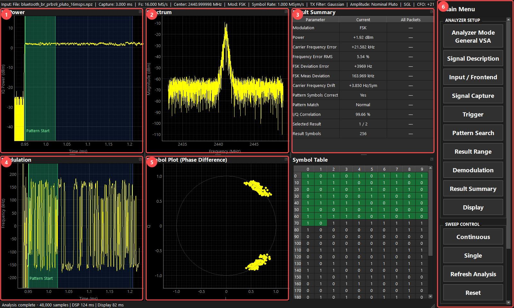

| 番号 | 領域 | 読み方 |
|---|---|---|
| 1 | IQ Power | 電力包絡、トリガ、Pattern、Result範囲の時間関係 |
| 2 | Spectrum | 受信帯域内の信号、隣接波、中心位置 |
| 3 | Result Summary | 測定値と同期診断値。専用モードではLimit・判定も表示 |
| 4 | Modulation | FSK瞬時周波数、PSK/QAMのIQ軌跡など |
| 5 | Symbol Plot | 判定時刻での周波数またはコンスタレーション。表はSymbol Table |
| 6 | 操作パネル | Analyzer Setup、Sweep Control、State、File、Device |

前回の位置・サイズを復元し、最小サイズは960×640です。Dockの見出しをドラッグして配置変更・別窓化ができます。モードごとの配置はアプリ動作中だけ記憶し、切替時に復元します。再起動すると内部配置・分割比率・選択タブは初期化します。リサイズ時の再均等化は行いません。

### 2.1 設定と実行を分けて操作する

| 操作 | 動作 |
|---|---|
| 設定画面のOK | 編集した設定を確定。自動キャプチャ・自動再解析はしない |
| Cancel / × / Escape | 編集を破棄。ファイルダイアログのフォルダ履歴は残る |
| Single | 現在の設定で1回取得し解析 |
| Continuous | 取得と解析を停止操作まで反復 |
| Stop / Stopping | 停止要求／終了処理中。終了後に次の操作を行う |
| Refresh Analysis | 現在保持しているIQを再解析。新しいIQは取得しない |
| Reset | 保持IQ・解析結果・プロット・パケット履歴・測定集計を消去。測定設定とDeviceは維持 |

`Reset`は右クリックのプロット範囲リセットとも、`State > Preset`とも異なります。取得・解析中はモード変更等が制限されます。次の操作へ進む前に処理完了を確認してください。

### 2.2 設定ページの対応

全モードの基本ページは`Signal Description`、`Input / Frontend`、`Signal Capture`、`Trigger`です。General VSAにはPattern Search、Result Range、Demodulation、Result Summary、Displayが加わります。BluetoothとDECTにはDisplayがあります。旧資料のBluetooth Analysis / DECT Analysis / ADS-B Analysisは、現在のSignal Descriptionを起点に読み替えます。

## 3. 実際の画面を使った操作

### 3.1 保存済みIQを解析する

1. `Analyzer Mode`で対象の変調・規格に合うモードを選びます。
2. `Signal Description`で変調、symbol rate、またはProtocol/PHYを設定してOKを押します。
3. `File > Import IQ`でファイルを選択します。読込後に解析が始まります。
4. 図1のIQ Powerに信号があり、Spectrumで帯域内に入っていることを確認します。
5. Result Summaryの同期状態、Modulation、Symbol Plotを確認します。
6. 条件を変えたらOK後に`Refresh Analysis`を押します。`Single`を押すと実機の新規取得になります。

NPZ / IQ TARにはsample rate等の情報を格納できます。NPY / CF32 / BIN等の情報不足ファイルではsample rateの入力が必要です。誤ったsample rateは時間・周波数・symbol rateの解釈をまとめて誤らせます。

### 3.2 General VSAでFSKを測る

図1は[保存済みBR受信IQ](../../tests/data/fixtures/bluetooth/br-edr/bluetooth_br_prbs9_pluto_16msps.npz)を汎用FSKとして解析した例です。`Signal Description`でFSK、1 MSym/s、参照偏移160 kHz、Gaussian、BT=0.5を設定します。これはBluetooth適合判定用の設定ではなく、汎用表示の例です。

1. IQ Powerでバースト区間を見つけます。
2. `Pattern Search`のLoad Patternで[図1用のパターン](examples/br-access-code.vsapattern.json)を読み、Pattern Search OnをONにします。LAP C6967Eの72-symbol Access Codeです。任意データ観測ではDetected Data系の同期も使用できます。
3. `Result Range`を256 symbols、Left、Offset 0にし、OK後にRefresh Analysisを押します。図1では2候補の先頭を表示しています。
4. 図1ではPattern Symbols CorrectがYes、I/Q Correlationが約99.66%、Carrier Frequency Errorが約+21.58 kHz、FSK Meas Deviationが約163.97 kHzです。パターン一致を確認してから変調値を読みます。数値はこの保存データと設定での例です。
5. 表示範囲をズームしても測定区間は変わりません。測定範囲はResult Rangeで変更します。

### 3.3 Bluetoothのパケットを確認する

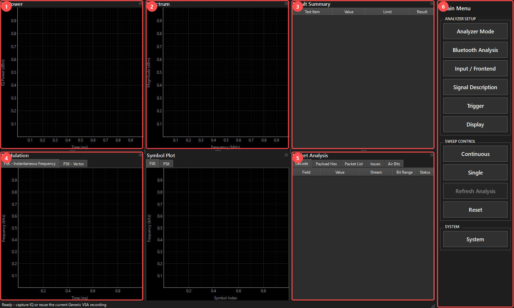

1. `Analyzer Mode > Bluetooth`を選びます。
2. `Signal Description`でProtocolとPHYを選びます。通常パケットはGeneral Packet、規格テスト信号はRF / PHY Testを使い分けます。
3. IQをImportし、図2のPacket AnalysisでPacket List、Decode、Issuesを確認します。
4. PHY、パケット長、HEC/CRCの妥当性を確認してからResult Summaryの値を読みます。
5. EDRのPSK部はModulation/Symbol PlotのPSK側へ切り替えて確認します。FSKヘッダ部と混同しないでください。

図2の1〜4は電力、スペクトラム、結果、変調、5はPacket Analysis、6は操作パネルです。`N/A`は対象外、条件不足、未定義のLimitなどを表し、PASSを意味しません。赤いFAILがある場合も、まず復号・テストパターン・入力条件が正しいか確認します。

図2は[保存済み2-DH1 IQ](../../tests/data/fixtures/bluetooth/br-edr/RT_Packet_TX_2DH1.npz)をGeneral Packet、Bluetooth BR / EDR、PHY Autoで読み込んだ例です。4 packetを検出し、選択packetのHECはvalidです。RMS DEVMは約3.74%ですが、General PacketでのN/A表示を規格合格と読み替えません。

### 3.4 DECTの変調と電力を確認する

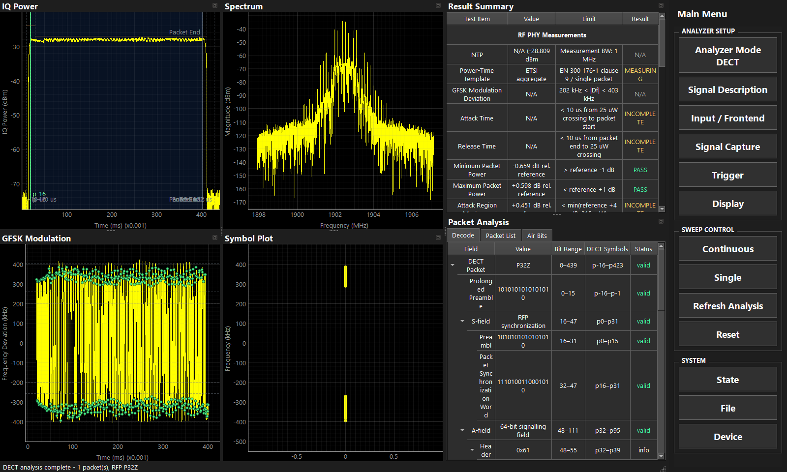

`Signal Description`でRegional Carrier PlanとRF Carrierを選び、IQをImportします。Packet Listから対象を選び、Direction、Packet Type、Case識別を確認します。これらを任意に指定する受信設定欄はなく、受信データから判定します。

図3は[保存済みDECT IQ](../../tests/data/fixtures/dect/DECT_PP_A5_OK.npz)をJP-DECT、F5 / 1902.528 MHzで解析した例です。検出結果はRFP P32Zです。ファイル名と検出結果を混同せず、N/A・INCOMPLETEを含む各項目の適用条件を確認します。

`Display > GFSK Modulation Reference`をMeasured / Nominal等へ変えると、FM表示で差し引く基準が変わります。表示基準変更を送信機の周波数変化と解釈しないでください。現在パケットの判定と複数パケットの集計を分けて読みます。

### 3.5 ADS-Bを確認する

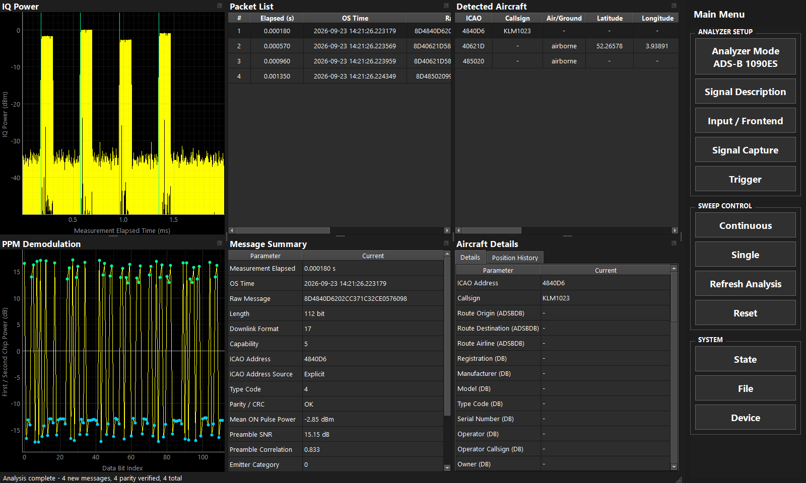

ADS-B 1090ESを選び、Import IQまたはSingleで解析します。Packet Listのメッセージを選択し、DF、ICAO、CRC/Parity、PPM波形を確認します。`Signal Description > Local CPR Reference`から受信局位置を設定します。位置表示には必要なCPRデータ・参照位置が揃う必要があり、各パケットから必ず緯度経度が得られるわけではありません。

### 3.6 Wi-Fi Non-HT OFDMを解析する

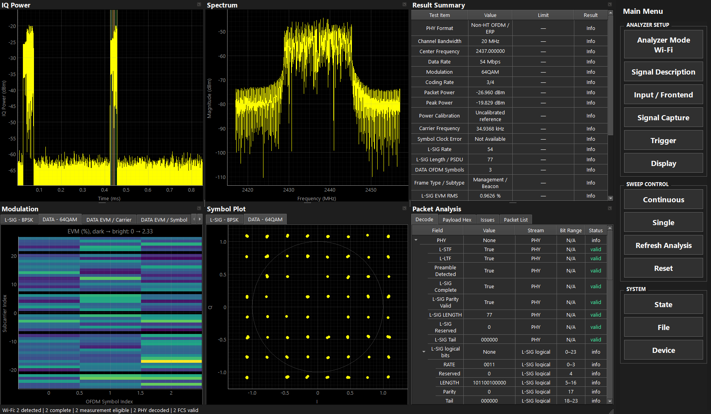

1. `Analyzer Mode > Wi-Fi`を選び、FileのImport IQで20/40 MS/sのNon-HT録音を開きます。
2. Packet Analysisの`Packet List`で対象packetを選びます。RateはL-SIGから自動検出されます。
3. DecodeでL-SIG Parity、DATA Complete、PSDU Complete、FCSを個別に確認します。欠落や異常はIssuesに表示します。
4. Symbol Plotの`L-SIG - BPSK`／`DATA - ...`で等化後のコンスタレーションを確認します。他モードと同じFlat（点）／Density（密度）表示を選べます。
5. Modulationは横軸OFDM symbol、縦軸subcarrier、色がEVMです。DATA EVM、Channel Magnitude/Phaseも内部tabで切り替えます。
6. RF取得ではDeviceを指定し、40 MS/s、十分なRF bandwidth（標準30 MHz）、対象中心周波数でSingleを実行します。
7. Continuousは有限取得と解析を反復します。Stopで停止後、Refresh Analysisで保持IQを再解析できます。

100 TU間隔のBeaconでは標準10 msのcaptureにpacketが入らない場合があります。150 ms程度へ広げるか、IQ Power triggerを使用してください。
20 MS/sは保存IQに対応しますが、Plutoライブ取得では既存の有効帯域制約により40 MS/sを使用します。
Bit Rangeは復号後のlogical bit座標です。MAC fieldと連続するIQ sample区間を対応付ける表示ではありません。

## 4. Input / Frontendの各項目

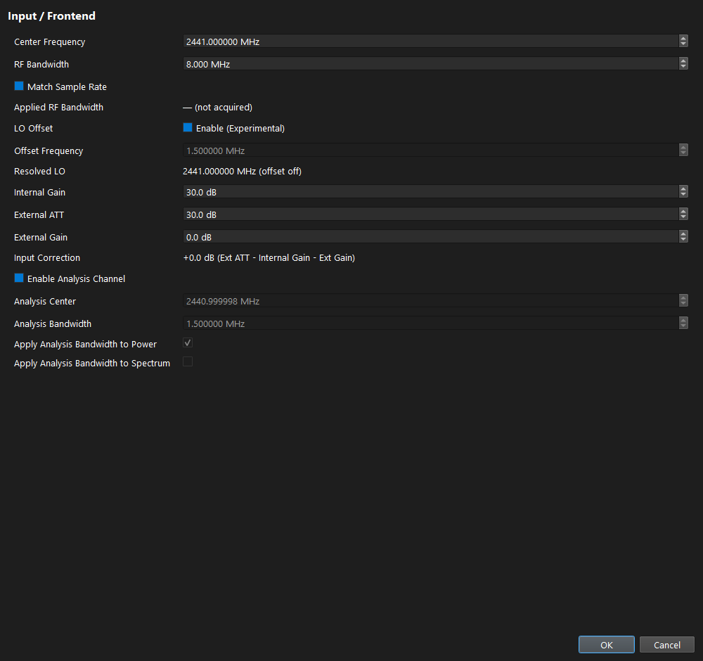

| 項目 | 個別説明 |
|---|---|
| Center Frequency | 要求する受信中心、MHz。General/Bluetoothで入力。DECTはCarrier選択、ADS-Bは1090 MHz固定 |
| RF Bandwidth | Pluto受信器のアナログRF帯域、MHz。解析用デジタルLPFとは別 |
| Match Sample Rate | RF Bandwidthをsample rateに追従させる。ON時はRF Bandwidthの手入力を無効化 |
| Applied RF Bandwidth | 最後の取得で報告された実適用値。未取得なら未表示。要求値と区別 |
| LO Offset / Enable (Experimental) | 要求中心からハードウェアLOをずらす。General/Bluetooth/DECTで対応。Analysis Channelが必要 |
| Offset Frequency | LOのずらし量、MHz。DC成分を解析帯域の外へ置くために使う |
| Resolved LO | 実際に要求するLO周波数。要求Centerと同じとは限らない |
| Internal Gain | Pluto内部受信利得、dB。入力飽和の回避と弱信号の観測に調整 |
| External ATT | 外部減衰量、dB。表示値へ加算する補正 |
| External Gain | 外部増幅器の利得、dB。表示値から差し引く補正 |
| Input Correction | `Ext ATT - Internal Gain - Ext Gain`の計算表示。直接編集しない |
| Enable Analysis Channel | デジタル周波数移動・LPF・必要に応じた間引きで解析チャネルを抽出 |
| Analysis Center | General VSAの解析中心、MHz。受信中心から独立に指定可能 |
| Analysis Bandwidth | 解析チャネルの帯域、MHz。信号全体を含め、隣接波は除くよう設定 |
| Apply Analysis Bandwidth to Power | Power表示にAnalysis Channel後IQを使用。OFFならRaw Capture |
| Apply Analysis Bandwidth to Spectrum | Spectrum表示にAnalysis Channel後IQを使用。OFFならRaw Capture |

Analysis Channelの設定UIはGeneral/Bluetooth/DECTにあります。ADS-Bには同じ設定欄はありません。Powerへの適用は初期ON、Spectrumは初期OFFです。同期・復号に使うIQの選択と、表示への適用ON/OFFを混同しないでください。

Offset LOを使う場合は、Analysis Bandwidthがsample rate未満で、LO offsetと解析帯域が取得可能帯域に収まる必要があります。またDC除外のため、offsetの絶対値はAnalysis Bandwidthの半分より大きくします。設定が成立しない場合はoffset、帯域、sample rateを見直します。

## 5. Signal Captureの各項目

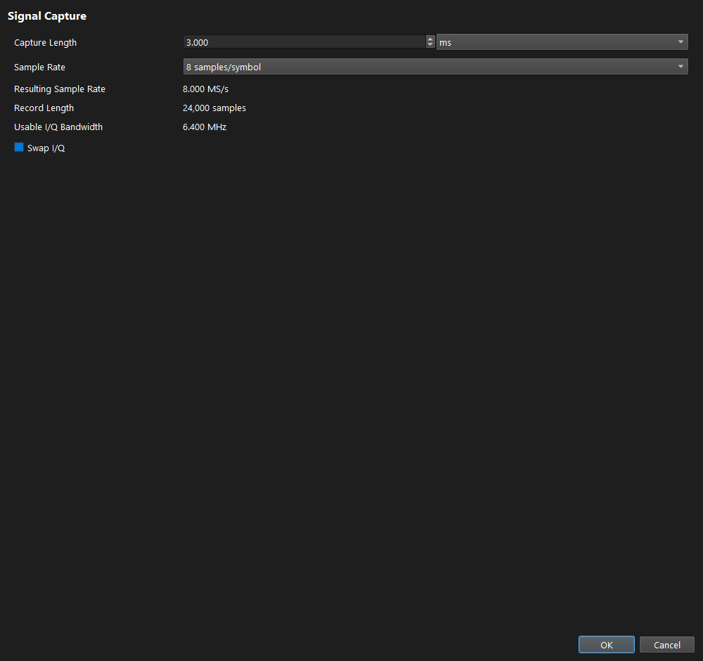

| 項目 | 個別説明 |
|---|---|
| Capture Length | 1回の取得長。必要なパケットと前後の余白を含める。長いほどメモリ・処理量が増加 |
| 単位 ms / Symbols | 時間またはsymbol数で入力。単位切替そのものは現在の取得時間を保持。ADS-Bはmsのみ |
| Sample Rate | Generalは2/4/8/16/32/64/128 samples/symbol。Bluetooth/DECTは4/8/16/32。ADS-Bは8/16 MS/s |
| Resulting Sample Rate | symbol rate×samples/symbolなどから求めた要求sample rate |
| Record Length | 取得時間×sample rateから求めたsample数 |
| Usable I/Q Bandwidth | sample rateとRF Bandwidthに基づく使用可能帯域の目安 |
| Swap I/Q | IとQを入れ替える。スペクトラム反転を伴うため通常はOFF。入力形式が逆の場合に使用 |

Samples/symbolを増やすと受信sample rateも上がります。Match Sample RateがONの場合、RF Bandwidthも追従します。ハードウェアの許容条件外になる組合せは確定できません。

## 6. Triggerの各項目

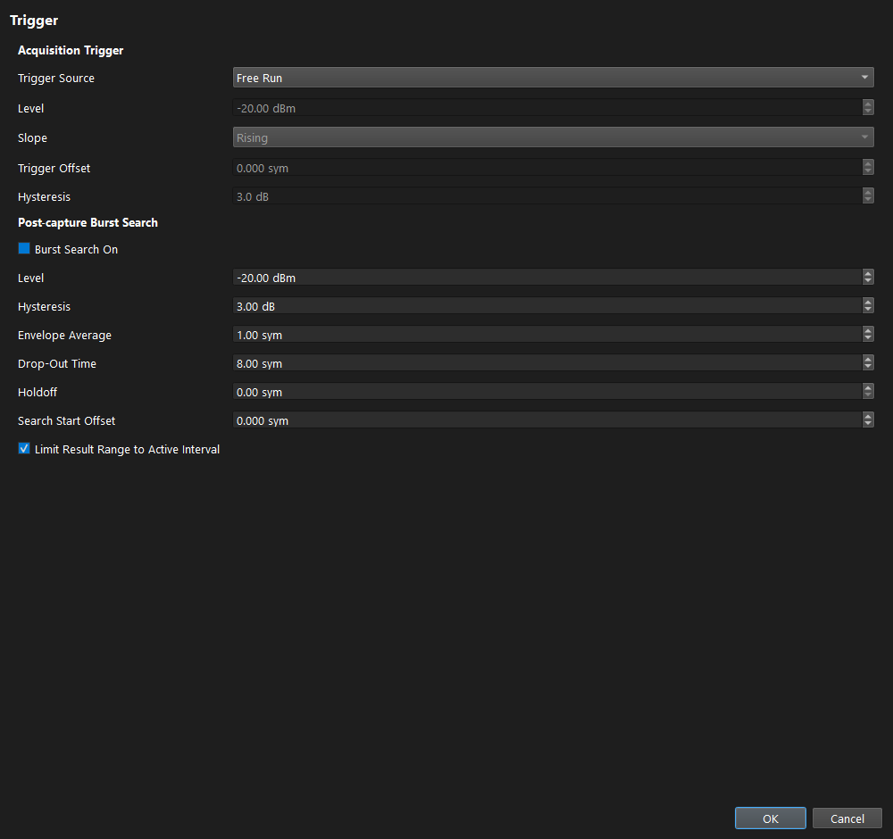

### 6.1 Acquisition Trigger

| 項目 | 個別説明 |
|---|---|
| Trigger Source | Free Runは条件待ちなし、I/Q Powerは電力条件で取得。Free RunではLevel等を無効表示 |
| Level | 取得トリガの電力閾値、dBm。ノイズ床と信号電力の間へ設定 |
| Slope | Rising / Falling / Either。閾値を横切る向き |
| Trigger Offset | 正値はトリガより後、負値は前からレコードを取得。General/Bluetooth/DECTはsymbol、ADS-Bはms |
| Hysteresis | 閾値付近の揺れによる再検出を抑える幅、dB |

### 6.2 Post-capture Burst Search

| 項目 | 個別説明 |
|---|---|
| Burst Search On | 取得済みIQ内の電力バースト検索を有効化。実機取得トリガとは独立 |
| Level | バースト検索の電力閾値。上段Levelとは別 |
| Hysteresis | バースト開始・終了の判定幅 |
| Envelope Average | 電力包絡を平均する時間幅。大きすぎると短いバーストがぼける |
| Drop-Out Time | 一時的に閾値を下回っても同じバーストとして扱う時間 |
| Holdoff | 検出後の再検出抑制時間 |
| Search Start Offset | 検索開始位置をずらす。不要な先頭領域を除外する場合に使用 |
| Limit Result Range to Active Interval | 有効電力区間に収まる結果を採用。途中に低電力があるOOK/PPMでは有効データを除外しないよう注意 |

下段の時間項目もADS-Bはms、他モードはsymbolです。閾値を上げるだけで同期品質が改善するわけではありません。検索区間からパケット末尾を切り落とさないようPower画面で確認します。

## 7. General VSA専用設定

### 7.1 Signal Description

| 項目 | 個別説明 |
|---|---|
| Modulation Type / Order | FSK、BPSK、QPSK、OQPSK、pi/4-DQPSK、8DPSK、pi/4-QPSK、8PSK、16QAMから選択 |
| Symbol Rate | シンボル速度、Sym/s。ビットレートと区別。QPSK等は1symbolが複数bit |
| FSK Ref Deviation | FSKの参照周波数偏移、Hz。測定偏移との誤差計算に使用 |
| Modulation Mapping | Natural / Gray / Bluetooth EDR / Bluetooth HDT。物理シンボルとbit値の対応 |
| Transmit Filter Type | None / Gaussian / Root Raised Cosine。送信波形モデルに合わせる |
| Alpha / BT | RRCのroll-offまたはGaussian BT。Filter TypeがNoneなら無効 |

### 7.2 Pattern Search

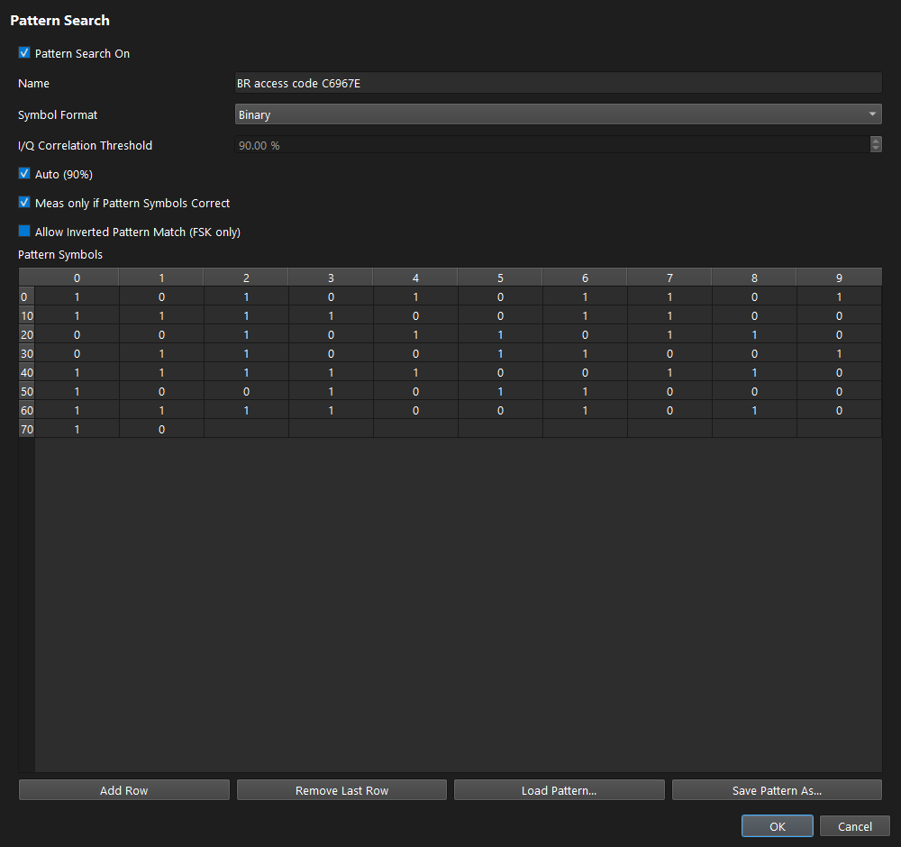

| 項目 | 個別説明 |
|---|---|
| Pattern Search On | 既知パターンによる同期探索を使用 |
| Name | パターンの識別名。シンボル列そのものは変更しない |
| Symbol Format | Binary / Decimal / Hexadecimal。入力・表示の表記方法 |
| I/Q Correlation Threshold | 相関の採用閾値、%。低くすると候補増加、高くすると取りこぼしが増える場合がある |
| Auto (90%) | 相関閾値を90%の自動設定へ戻す |
| Meas only if Pattern Symbols Correct | パターン復号が一致した結果だけを測定対象とする |
| Allow Inverted Pattern Match (FSK only) | FSKの周波数極性が反転した候補も探索 |
| Pattern Symbols | 期待するシンボル列。変調次数に収まる整数を入力 |
| Add Row | シンボル行を追加 |
| Remove Last Row | 最終行を削除 |
| Load Pattern | `.vsapattern.json`を読み込む |
| Save Pattern As | 名前、シンボル、表記形式を保存 |

Pattern Symbolsは常に生のbit列と同じとは限りません。変調次数・Mapping・Bit Orderingを送信側に合わせてください。

### 7.3 Result Range

| 項目 | 個別説明 |
|---|---|
| Result Length (Symbols) | 測定・復調対象のsymbol数 |
| Reference | 現在の選択肢はPattern Waveform。基準の種類を示す |
| Alignment | Left / Center / Right。基準パターンと結果窓の位置関係 |
| Offset (Symbols) | 基準からの正負の移動量。負値なら前の領域も含む |
| Symbol Number at Pattern Start | 現行UIでは無効。任意の表示番号付替えには使用できない |
| Exclude incomplete Result Range | 設定した結果窓全体が取得データに収まらない候補を除外 |
| Previous / Next Result Range | 複数候補間を移動。既存の左右キー操作も利用可能 |

### 7.4 Demodulation

| 項目 | 個別説明 |
|---|---|
| Coarse Synchronization | Auto / Detected Data / Pattern。初期同期で使う情報源 |
| Fine Synchronization | 現行UIは無効。独立指定せずCoarse側の情報源に従う |
| Measurement Filter | Autoは変調・送信フィルタに応じた処理、Noneはその受信フィルタを無効化。Analysis Channelは別 |
| Bit Ordering | MSB / LSB。1symbol内のbit展開順序。bit比較時に合わせる |
| Carrier Frequency Drift | 搬送波ドリフト補償、実験的機能。初期OFF。ON/OFFを比較するときは測定条件として記録 |
| FSK Deviation Error補償 | 無効項目。測定偏移を参照値へ自動補正する機能として使用しない |

### 7.5 Result Summary

チェックした行を表示します。測定結果と同期診断を分けて選べます。

| 項目 | 読み方 |
|---|---|
| Modulation | 現在の変調条件 |
| Power | 対象区間の電力。入力補正・校正基準面を確認 |
| Carrier Frequency Error | 推定搬送波と要求中心の差 |
| EVM RMS | 理想シンボルからの二乗平均誤差。汎用同期・正規化条件に依存 |
| Differential Symbol EVM RMS | 差動シンボル表現上の誤差 |
| Bluetooth DEVM RMS | Bluetooth向け差動誤差評価。汎用EVMとは別定義 |
| Symbol Rate Error | 推定symbol rateと参照値の差 |
| Frequency Error RMS | FSK周波数系列の参照に対する誤差 |
| FSK Deviation Error | 参照偏移と測定偏移の差 |
| FSK Meas Deviation | 推定された周波数偏移 |
| FSK Ref Deviation | 設定した参照偏移 |
| Carrier Frequency Drift | 解析区間での搬送波変化 |
| Pattern Symbols Correct | パターンシンボルの一致状態 |
| Pattern Match | 採用されたパターン候補 |
| I/Q Correlation | IQ相関の強さ。CRC合格とは別 |
| Selected Result | 現在表示する候補番号 |
| Result Symbols | 実際に評価したsymbol数 |
| Pattern Error | 期待パターンに対する誤り |
| Estimated Carrier | 同期で推定した搬送波成分 |
| Display | 表示系列の診断情報 |
| PSK Carrier Drift | PSK同期で推定した位相回転の変化 |
| Sync EVM RMS | 同期の評価用EVM。最終の規格値とは区別 |
| Fractional Timing | 1sample未満のsymbol時刻補正 |
| Frequency Fit RMS | 周波数モデルへの当てはめ残差 |
| Timing Confidence | symbol時刻推定の信頼度指標 |
| Deviation Error (%) | 偏移誤差の相対表示 |
| Drift Model | 適用・評価したドリフトモデル |
| Applied Drift | 実際に適用した補償量 |

`Show All`は選択可能な全項目、`Measurement Only`は測定値、`Diagnostics Only`は診断値、`Restore Defaults`は既定の行選択へ戻します。無効なEVM Peak、MER、I/Q不平衡などの行は、実装済み測定として扱いません。

## 8. Bluetooth・DECT・ADS-BのSignal Description

### 8.1 Bluetooth

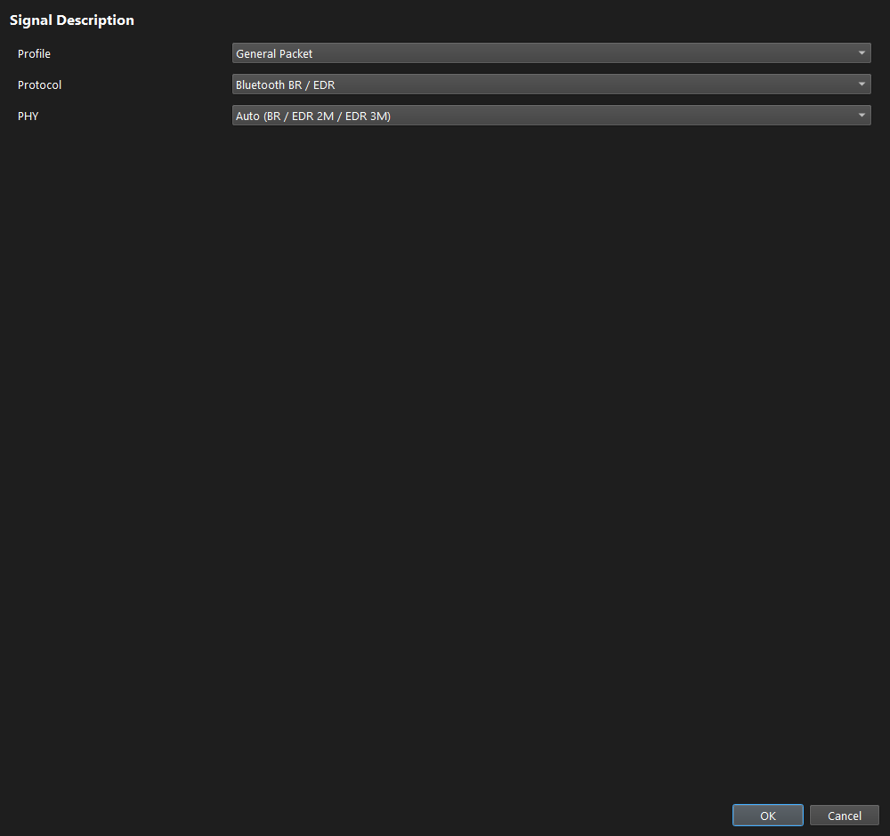

| 項目 | 個別説明 |
|---|---|
| Profile | RF / PHY Testは規格テスト条件、General Packetは通常パケットの解析。適用可能なRF測定項目も変わる |
| Protocol | Bluetooth BR / EDR、Bluetooth LE、Bluetooth HDT |
| PHY | ClassicはAuto / BR / EDR 2M / EDR 3M、LEはLE 1M / LE 2M。HDTは対応rateの自動判定 |
| LAP | Classicアクセスコードに関係するアドレス下位部、hex。テスト信号条件と合わせる |
| UAP | Classicヘッダ検査に関係するアドレス部、hex |
| CLK6-1 | Classic whitening等のクロック条件。0〜63の整数で入力 |
| Access Address | LEテスト同期語。RF / PHY Testでは固定表示 |
| LE Channel | LEのチャネル条件。周波数とwhitening条件を取り違えない |
| CRC Init | LEテストCRC初期値。RF / PHY Testでは固定表示 |
| Expected EDR RF Test Packet | 期待するEDRのテストパケット種別。Not configuredではその確認条件を与えない |
| Whitening | 規格・Profileに応じて使用。LE RF / PHY TestではOFF固定 |

identity入力はProtocol/Profileに応じて非表示・無効になります。General Packetでは手入力identityを隠し、自動取得を使います。Symbol rateや測定区間はProtocol/PHY・検出パケットから決まり、General VSAの任意Result Rangeと同じ操作ではありません。

### 8.2 DECT

| 項目 | 個別説明 |
|---|---|
| Regional Carrier Plan | ETSI/Europe、US、Japan、拡張帯域等の周波数プラン |
| RF Carrier | 選択プラン内のキャリア番号と周波数。要求受信中心を決める |
| Modulation | GFSK、BT=0.5の確認表示 |
| Symbol Rate | 1.152 MSym/sの確認表示 |

方向・packet type・RF変調テストCaseは解析結果で確認します。送信波形の任意field編集はVSG側の機能です。

### 8.3 ADS-B

| 項目 | 個別説明 |
|---|---|
| Protocol | ADS-B 1090ESの固定表示 |
| Preamble SNR Threshold | preamble候補に必要なSNR、dB。低くすると候補増加・誤検出増加の可能性 |
| Local CPR Reference | 受信局位置設定を開く。Local CPRの参照位置 |
| Latitude | 緯度、degree。北緯を正、南緯を負 |
| Longitude | 経度、degree。東経を正、西経を負 |
| Select on Map | 地図から参照位置を選択 |
| Clear | 参照位置を解除 |

### 8.4 Wi-Fi

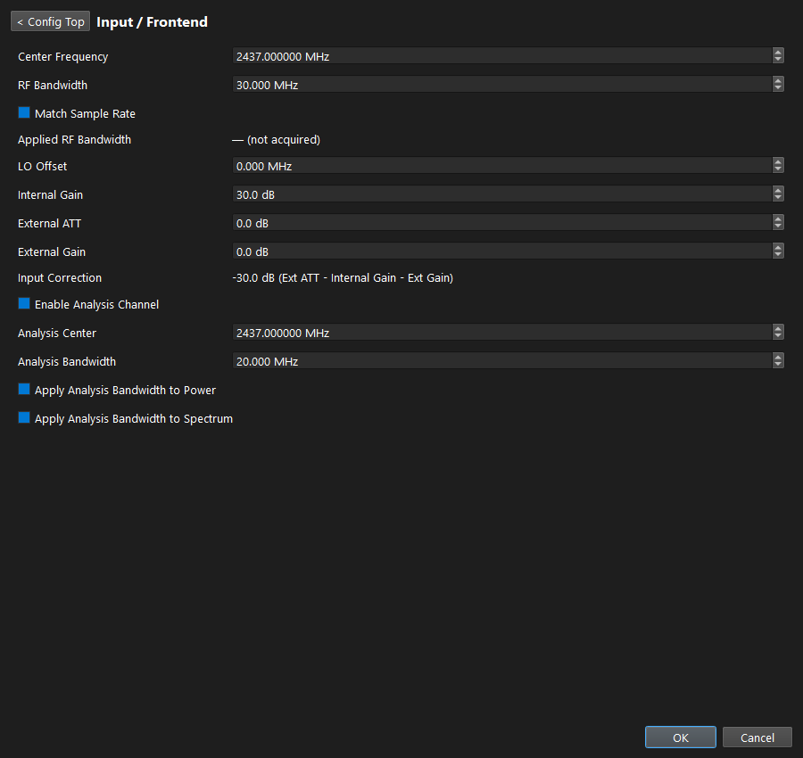

| 設定 | 説明 |
| --- | --- |
| PHY / Bandwidth / Rate | Non-HT OFDM / 20 MHz / L-SIGからAuto。変調の事前指定は不要 |
| Channel / Nominal Center | 2.4 GHz Channel 1〜13。選択すると次回受信中心周波数を変更 |
| Center Frequency | キャプチャの受信中心。保存IQの解析では録音の周波数情報を使用 |
| RF Bandwidth / Match Sample Rate | 受信器analog bandwidth。Sample Rate一致を選んだ場合も既存hardware範囲内で検証 |
| LO Offset | experimental offset LO。共通のAnalysis Channel・有効帯域・DC回避条件を満たす組合せのみ |
| Internal Gain / External ATT / External Gain | 共通の入力電力補正。録音の補正・校正情報を測定値へ反映 |
| Enable Analysis Channel / Center / Bandwidth | 共通DDC/LPFで解析対象帯域を選択。新条件の反映はRefresh Analysisまたは次回取得 |
| Apply Analysis Bandwidth to Power / Spectrum | 個別に元capture面かanalysis-channel面を表示。Powerの選択はSummaryのpacket/peak powerにも適用 |
| Sample Rate | 20/40 MS/s。ライブ受信は40 MS/sを推奨・有効帯域で検証 |
| Capture Length | 有限取得時間。Continuousもこの単位の取得を反復 |
| Swap I/Q | 共通取得設定。IQの入れ替えが必要な入力条件に使用 |
| Trigger | Free Run / I/Q Power、Level、Slope、Offset、Hysteresis。packet検出自体はL-STFを使用 |
| Symbol Plot Trace | 等化後の測定点をFlat（点）／Density（密度）表示。他モードと共通の描画方法 |
| Density Spread | None / Medium / Maximum。密度表示の広がり。解析結果には影響しない |
| Show synchronization diagnostics | STF metric、LTF correlation、coarse/fine CFOをSummaryへ追加 |

EVM RMS/Peakは等化・pilot位相補正後の48 data subcarrierを測定し、L-SIGとDATAを分けます。
RFのLimitは推測で設定せずInfo表示です。Symbol Clock Errorは未実装のためNot Availableと表示します。
Power CalibrationがUncalibrated referenceの場合、表示dBmを実機校正済みの絶対電力として扱わないでください。
実RFの検出・EVM・powerを確認する手順は[Wi-Fi手動受入](../verification/vsa/wifi/non-ht-hardware.md)にあります。

## 9. Display・プロット・パケット選択

| 項目 | 対象と個別説明 |
|---|---|
| Show Symbol Points | General/Bluetooth/DECT。判定時刻の点を表示 |
| Symbol Table Format | General。Hexadecimal / Decimalで表を切替 |
| IQ Power Signal | General。Raw Capture / Measuredの電力系列を選択 |
| Modulation Signal | General。Raw IQ / Measuredの変調表示を選択 |
| QAM Modulation Signal | GeneralのQAM専用表示系列。PSK/FSKとは独立 |
| Symbol Plot Trace | Flatは点表示、Densityは出現密度表示 |
| Density Spread | None / Medium / Maximum。密度の広がり。測定値を平滑化する設定ではない |
| PSK Symbol Plot | Physical IQ / Differential IQ。物理IQ点と差動表現を切替 |
| FSK Symbol Plot | Phase Difference / Constellation Frequency。FSKの位相差・周波数分布を切替 |
| Reset Plot Scales | Generalのプロット表示範囲を既定へ戻す |
| GFSK Modulation Reference / Measured | DECT。観測された搬送波基準を差し引く |
| Window Mean | DECT。測定窓の平均周波数を基準にする |
| Nominal | DECT。公称0 Hzを基準にし、周波数ずれを残して見る |
| Half Peak | DECT。選択区間の最大・最小周波数の中点を基準にする |

ドラッグ・ホイールで表示を調整し、右クリックの`Reset`でプロットの範囲を戻せます。専用モードのPacket Listや左右キーで対象packetを変えると、選択に応じたModulation等を表示します。プロットのズームやDensityは測定対象IQそのものを書き換えません。

## 10. State・File・Device

| 操作 / ファイル | 保存・読込の内容 |
|---|---|
| State > Save / `.vsaconfig.json` | 現モードと測定設定を保存。IQは含まない |
| State > Recall | 保存元モードへ切り替えて設定を復元。実機接続先を勝手に切り替えず、自動キャプチャもしない |
| State > Preset > Default | 現モードを既定設定へ戻す |
| Device | 全モードで共有するPluto接続先を選ぶ |
| File > Import IQ | IQ TAR / NPZ / NPY / CF32 / BIN等。モードのファイルフィルタで対応形式を確認 |
| File > Export IQ | NPZ。Raw captureまたはSoftware DC removedを選択して保存 |
| Export Symbol Table | General。`.vsasymbols.json`へsymbol/bit列と解析情報を出力。CSVではない |
| Export VSG Project | Bluetooth/DECT。復号したpacketから`.pvsg.json`を作成。送信RF条件・timingはテンプレート既定値を含む |
| Export Packet List | ADS-B。packet履歴をJSON Linesへ出力 |
| Import OpenSky CSV | ADS-B。航空機メタデータCSVを登録 |
| Update Database | ADS-B。確認後にOpenSkyデータを取得してデータベースを更新 |

DECTの変調・電力デバッグCSVは開発用の追加出力です。通常の共通Fileページに並ぶ項目とは別で、表示経路・測定値の調査に使います。

フォルダ履歴はIQ、測定設定、パターン、symbol表、VSG project、各デバッグCSV、航空機CSV、ADS-B packet listごとに独立します。同種別の保存・読込は共有し、再起動後も復元します。キャンセルでは更新しません。

## 11. 結果の解釈と切り分け

| 症状 | 確認する内容 |
|---|---|
| 結果がN/A | 対象PHY・テストパターン・有効区間・必要packet数・Limit定義 |
| CRC/HECが不正 | Protocol、PHY、whitening、sample rate、packet末尾の欠落 |
| 大きいEVM/DEVM | 飽和、CFO、symbol timing、Analysis Bandwidth、対応するMeasurement Filter |
| Spectrum中心が違う | Raw表示はHardware LO基準か、Analysis後のRequested Center基準か |
| 変調設定を変えても結果が同じ | OKで確定した後にRefresh Analysisを実行したか |
| Reset後にExportできない | IQと結果を消去したため。再取得またはImport IQが必要 |
| バーストが途中で切れる | Capture Length、Trigger Offset、Drop-Out Time、Active Interval制限 |
| Device busy | 他アプリが同じPlutoを保持していないか確認 |

PASS/FAILは実装した条件に対する結果です。通常パケットのCRC正常だけでRF適合性を保証せず、反対に条件不成立のN/AをRF不良と即断しないでください。
