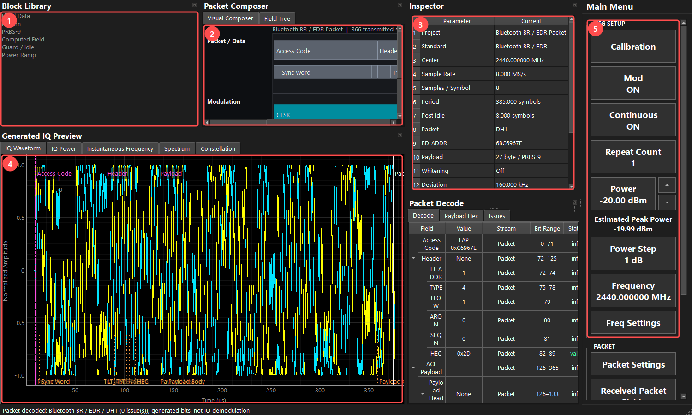
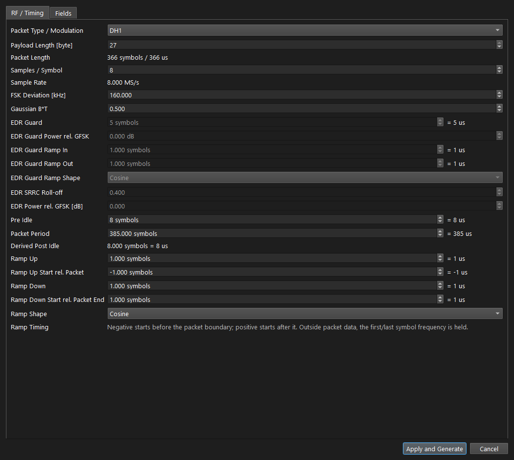
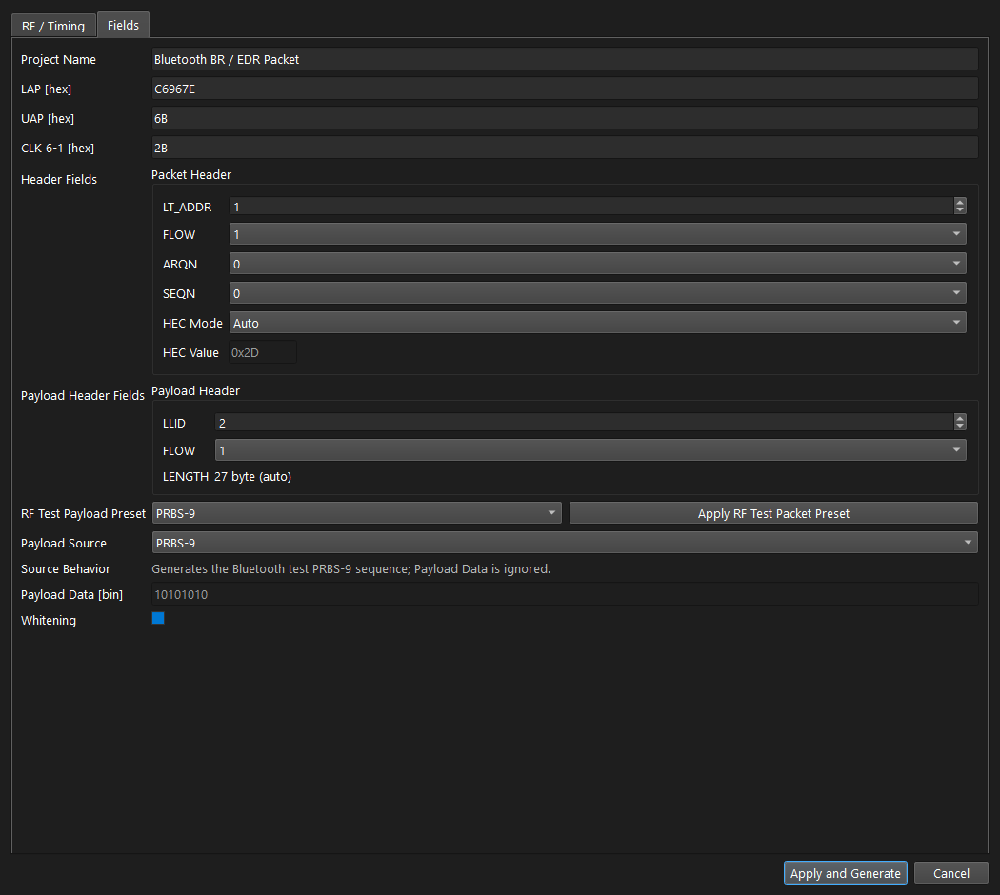
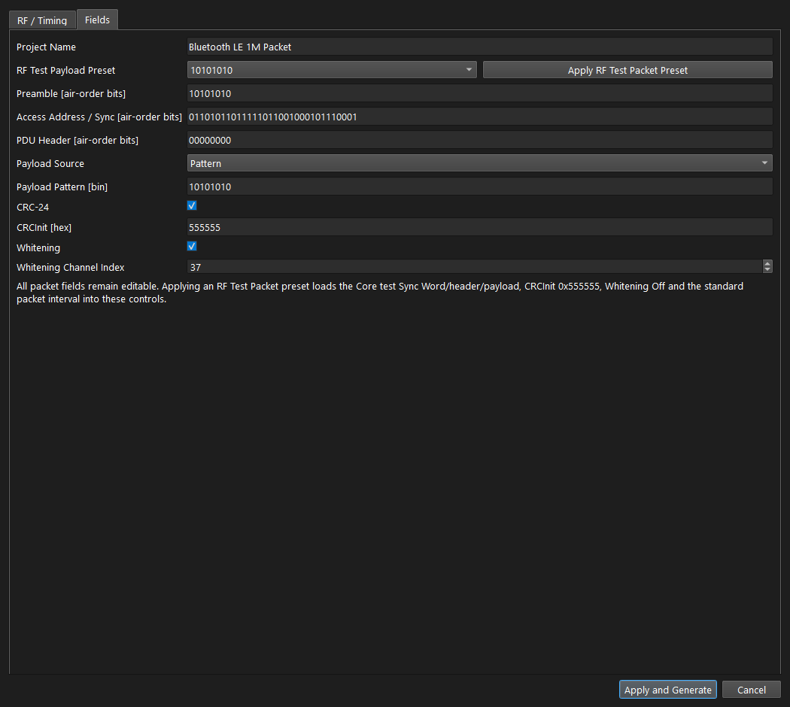
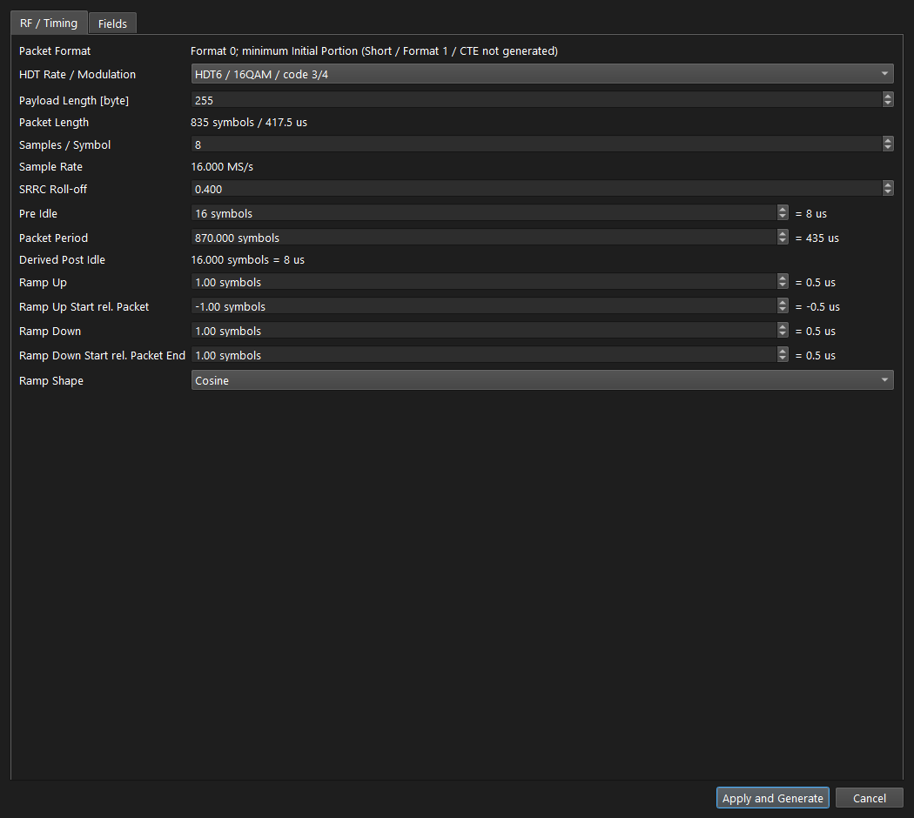
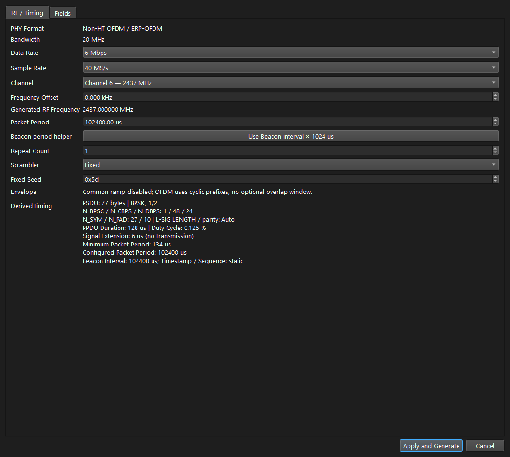
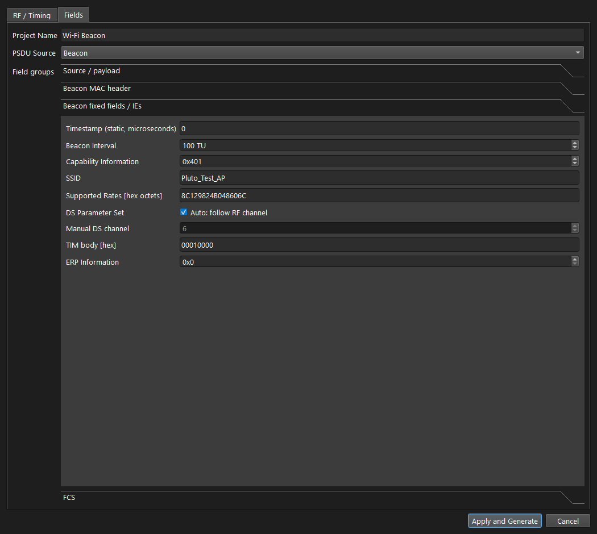
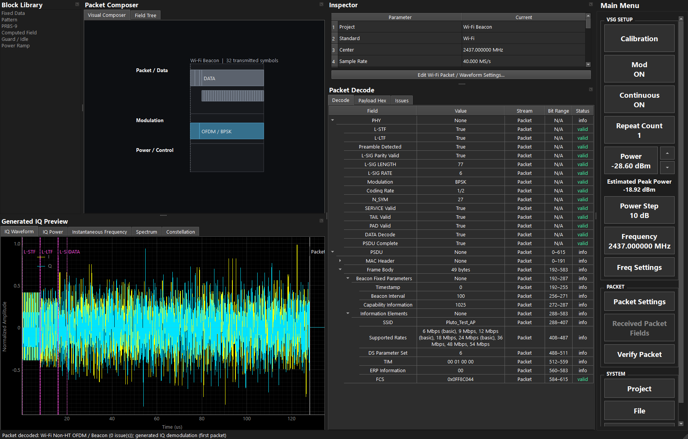
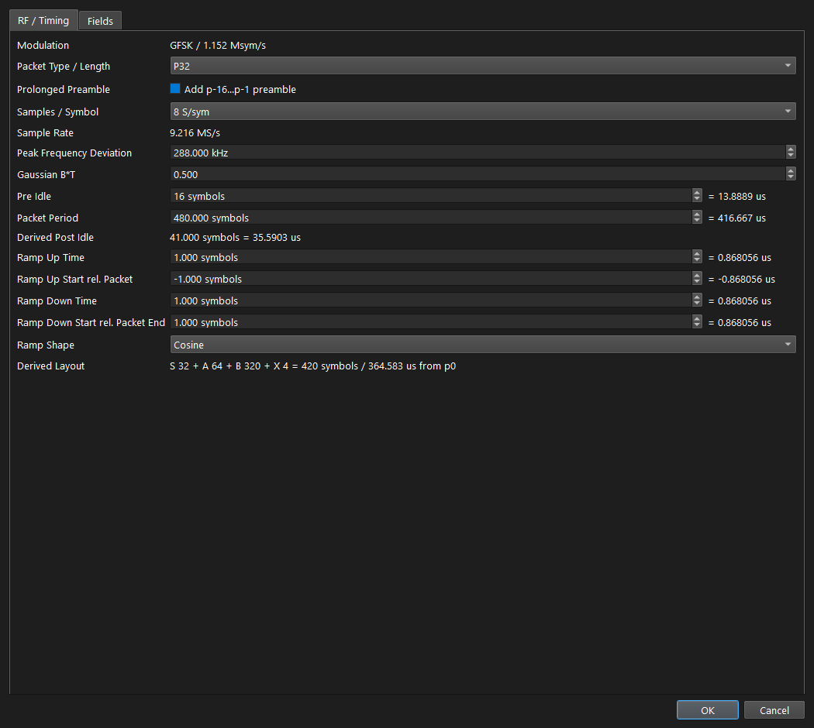
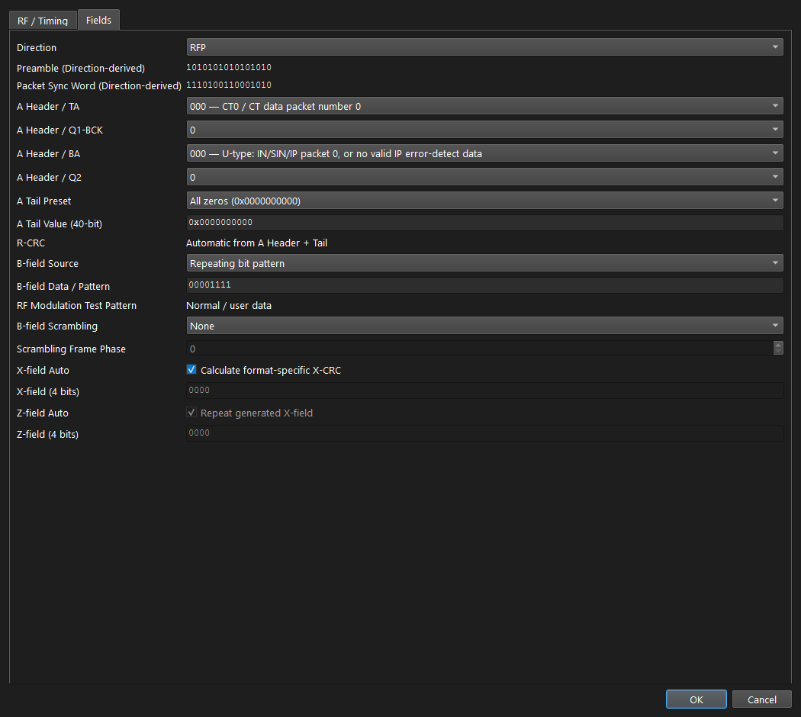

# Pluto VSG ユーザーマニュアル

文書版: 2.0 レビュー版（2026-09-23）

対象: Pluto VSG / アプリ仕様の確認基準: `b43f7e6`

## 1. できることと読み方

Pluto VSGはBluetooth BR/EDR、LE、HDT、Wi-Fi、DECTのpacketからIQ波形を生成し、ファイルへ出力、またはPlutoから送信します。本書の画面は現在のアプリで波形を生成して撮影したものです。画面のPreviewは生成IQであり、実機の出力波形を受信測定したものではありません。

最初は第3章の生成・検証手順を実行してください。送信操作は第4章、全設定の個別説明は第5章以降です。右パネルの下部はスクロールし、`Back`で前のページへ戻ります。

## 2. 起動と画面

`Pluto_VSG.bat`を起動します。波形生成やExportにはPluto接続は不要です。送信時は`Device`で個体を指定し、タイトルの`TX`表示を確認します。起動だけでRF送信は開始しません。

| 領域 | 見る内容 |
|---|---|
| 1 Block Library | 波形要素の分類。表示される項目すべてが自由編集可能とは限らない |
| 2 Packet Composer | 上段はpacket/field、下段は変調・電力制御。Field Treeで構造を確認 |
| 3 Inspector | 規格、sample rate、payload、periodなど生成条件。下の編集ボタンから設定へ進める |
| 4 Generated IQ Preview | I/Q、電力包絡、瞬時周波数、Spectrum、Constellation |
| 5 右操作パネル | Calibration/RF、Mod、Continuous、Power、Frequency、Packet Settings、Project、File、Device |
| Packet Decode | Verify PacketのDecode / Payload Hex / Issues。Wi-Fiは生成IQを復調、それ以外は生成bit列を解析 |

位置・サイズを再起動後も復元し、最小サイズは960×640です。5つのDockを移動・別窓化できます。内部配置・分割比率・選択タブは再起動時に初期化します。リサイズでは再均等化しません。

## 3. 画面を使った生成・検証・保存

### 3.1 Bluetooth packetを作る

1. `Project > New > Bluetooth BR/EDR`を選びます。
2. `Packet Settings`を開きます。`RF / Timing`でPacket Type / Modulation、Payload Length、Samples / Symbolを選びます。
3. `Fields`でLAP/UAP、Header、payload、whiteningを設定します。テストパターンはRF Test Payload Presetから選べます。
4. `Apply and Generate`で確定・生成します。不正な入力は修正してから確定します。
5. 図1のComposerでfield順序、Previewで波形とpacket前後のidleを確認します。
6. `Verify Packet`を押し、Packet DecodeのHEC/CRCやIssuesを確認します。
7. `Project > Save`で`.pvsg.json`、`File > Export NPZ`でIQを保存します。

Verify PacketはBluetooth / DECTでは生成bit列をdecodeし、Wi-Fi Non-HTでは生成済みIQの最初のpacketを独立復調してL-SIG・PSDU・FCSを検証します。アナログRF出力品質や実機相互接続を検証する操作ではありません。変調品質を評価する場合はExportしたIQをVSAで解析するか、実機で送受信して測定します。

### 3.2 VSAとのファイル連携

VSGでExport NPZしたファイルをVSAの`File > Import IQ`で読み込みます。Protocol/PHYとsample rateを確認します。VSAの`Export VSG Project`から受信packetをVSGへ持ち込むこともできます。ただし受信packetからは元送信機の全RF条件・ramp・periodは復元できず、テンプレート値を含みます。送信前に設定を確認してください。

## 4. RF送信の操作と状態

1. `Device`でPluto、Digital Backoff等を指定します。
2. `Freq Settings`または`Frequency`で周波数、`Power`で目標出力を設定します。
3. `Mod`、`Continuous`、`Repeat Count`を目的に合わせます。
4. `Calibration`表示の場合は校正操作を実行します。完了後も送信しません。
5. `RF OFF`からRFボタンを押して送信します。Continuous送信は再度押して停止します。

送信機と受信機をケーブルで接続する場合は外部ATTを入れ、受信側の許容入力内にします。図版作成時にはRFを送信していません。

| 状態・項目 | 意味 |
|---|---|
| Calibration | 現在の周波数・sample rate等で送信準備が必要 |
| Calibrating | 校正処理中。完了まで待つ |
| RF OFF | 送信停止。押すと現在条件で送信開始 |
| Transferring | IQ転送・開始処理中 |
| RF ON | 送信中。押すと停止 |
| Stopping | 停止・buffer解放中。完了を待つ |
| Mod ON | 生成した変調IQを送信 |
| Mod OFF | CWを連続送信。Continuousの有限回設定には従わない |
| Continuous ON | 生成波形の先頭1 packet periodをcyclic DMAで反復 |
| Continuous OFF | Mod ON時、Repeat Countで指定した有限回を送信 |
| Repeat Count | 有限送信のpacket数。連続送信の周期長を増やす項目ではない |

周波数等を変えるとPrepared状態が無効になります。校正直後は再度RFを操作して送信します。RF OFFを理想的な完全遮断や外部RFレベルの測定結果と同一視しないでください。

## 5. 共通のRF / Timing設定

規格によって項目名・有効範囲が変わります。数値欄の単位と自動計算表示を確認します。

| 項目 | 個別説明 |
|---|---|
| Packet Type / Modulation、PHY、Rate | packet形式と変調を選択。必要なfield、最大payload長、symbol rate等が連動 |
| Payload Length [byte] | payloadのbyte数。packet全長ではない |
| Packet Length | preamble/header等を含む長さの計算表示 |
| Samples / Symbol | 1symbolを表すsample数。増やすとsample rateとIQファイル量が増える |
| Sample Rate | symbol rateとsamples/symbolから決定。Wi-Fiは20/40 MS/sを選択 |
| FSK Deviation / Peak Frequency Deviation | FSKの片側周波数偏移。画面のkHz/Hz単位を確認 |
| Gaussian B*T | Gaussian送信フィルタのBT。小さくすると帯域が狭くなる一方、symbol間の影響が増える |
| SRRC Roll-off | PSK/QAMの送信パルス整形。対応する受信側条件と揃える |
| Pre Idle | packet開始前の無信号区間、symbol。併記のus換算で時間を確認 |
| Packet Period | 1周期の開始から次周期開始まで。packet・ramp・idleを収める |
| Derived Post Idle | 指定periodから自動計算された末尾idle。直接編集しない |
| Ramp Up / Ramp Up Time | 立ち上がりに使う時間またはsymbol数 |
| Ramp Up Start rel. Packet | packet開始基準のramp開始位置。負値はpacketより前 |
| Ramp Down / Ramp Down Time | 立ち下がりに使う時間またはsymbol数 |
| Ramp Down Start rel. Packet End | packet末尾基準の開始位置。packetのデータを切らないよう確認 |
| Ramp Shape | Cosine / Linear。電力包絡の移行形状 |
| Ramp Timing / Derived Layout | 設定から計算した境界位置・時間の確認表示 |

Periodが短すぎてpacket/rampを収められない設定は確定できません。長いpost idleは初期Preview範囲から外れる場合があります。ズームアウトして周期全体を確認できます。

## 6. Bluetooth BR/EDRの個別設定

### 6.1 RF / Timingの追加項目

| 項目 | 個別説明 |
|---|---|
| Packet Type / Modulation | DH1/DH3/DH5、2-DH1/3/5、3-DH1/3/5。EDRではGFSKヘッダとDPSK payloadを生成 |
| EDR Guard | GFSKとDPSKの間のguard長 |
| EDR Guard Power rel. GFSK | guard区間の相対電力。基準はGFSK部 |
| EDR Guard Ramp In | guardへ入る移行時間 |
| EDR Guard Ramp Out | guardから出る移行時間 |
| EDR Guard Ramp Shape | guard移行部のCosine / Linear |
| EDR SRRC Roll-off | EDR PSK部の送信フィルタroll-off |
| EDR Power rel. GFSK [dB] | PSK部のGFSK部に対する相対電力。正値はPSKが高い |

### 6.2 Fields

| 項目 | 個別説明 |
|---|---|
| Project Name | プロジェクトの識別名 |
| LAP [hex] | Bluetoothアドレス下位部。Access Code等の生成に使用 |
| UAP [hex] | アドレス上位部の一部。HEC等の生成条件 |
| CLK 6-1 [hex] | whitening等に使用するクロックbit |
| Header / LT_ADDR | logical transportアドレス |
| Header / FLOW | ヘッダのフロー制御bit |
| ARQN | 受信応答bit |
| SEQN | シーケンスbit |
| HEC Mode | Autoはヘッダから生成、Manualは指定値を使用 |
| HEC Value | Manual時の検査値。意図的な誤りpacketにも使用できる |
| Payload Header / LLID | payloadの論理リンク種別 |
| Payload Header / FLOW | payload headerのフロー制御bit。HeaderのFLOWとは別 |
| Payload Header / LENGTH | payload headerへ載せる長さ。payload条件との整合を確認 |
| RF Test Payload Preset | PRBS-9、Constant 0/1、1010、11110000等を一括設定 |
| Payload Source | Constant / Repeating Bit Pattern / PRBS-9 |
| Source Behavior | 現在のsourceの繰返し・生成方法の説明表示 |
| Payload Data [bin] | 固定bitまたは繰返しpattern。画面のsourceと合わせて指定 |
| Whitening | packet bit列へのwhitening適用。受信側も同じ条件にする |

## 7. Bluetooth LEの個別設定

RF / TimingではPHYをLE 1M / LE 2Mから選びます。Modulationは対応するGFSK条件の表示です。その他の取得密度・偏移・ramp・periodは第5章を参照してください。

| Fields項目 | 個別説明 |
|---|---|
| Project Name | 識別名 |
| RF Test Payload Preset | PRBS9、PRBS15、11110000、10101010等。選ぶとテスト同期語・header・CRC初期値・whitening OFF・periodも設定 |
| Preamble [air-order bits] | 送出順のpreamble bit列 |
| Access Address / Sync [air-order bits] | 送出順の同期語。整数hexの見た目とbit順を混同しない |
| PDU Header [air-order bits] | 送出順のPDU header。packet種別・長さ等を含む |
| Payload Source | Fixed / Pattern / PRBS9 / PRBS15 |
| Payload Pattern [bin] | 固定データまたは繰返しpattern |
| CRC-24 | CRC付加の選択。受信側の期待条件と揃える |
| CRCInit [hex] | CRC初期値。RFテストpresetは0x555555 |
| Whitening | データwhiteningの有効化。RFテストpresetではOFF |
| Whitening Channel Index | whitening系列を決めるチャネル番号。単なるRF周波数欄ではない |

Preset適用後も各fieldは編集できます。Preset名を選んだだけで、その後の手編集を含むpacketが規格条件を維持するとは限りません。

## 8. Bluetooth HDTの個別設定

| 項目 | 個別説明 |
|---|---|
| Packet Format | 実装するpacket formatの確認表示 |
| HDT Rate / Modulation | HDT2、3、4、6、7.5。pi/4-QPSK、8PSK、16QAMと符号化率が連動 |
| SRRC Roll-off | HDT送信パルス整形のroll-off |
| Project Name | 識別名 |
| Training / Preamble | 同期・参照に使うtrainingの確認表示 |
| Packet Profile | テストpacket構成の識別表示 |
| PCA [40-bit hex] | training/PCA条件を指定する40bit値 |
| PCA-A / HEC Init (auto) | PCAから決まる値を表示。別々に任意入力する欄ではない |
| NESN | 次に期待するシーケンス番号 |
| Control Header (auto) | rate・length等から生成したheaderを確認 |
| HEC-C Mode | 自動計算または手動HEC-Cの選択 |
| Manual HEC-C [hex] | 手動検査値 |
| XHP / RxPP (fixed) | 固定条件の表示 |
| MD | 後続データの有無 |
| SN | シーケンス番号 |
| LLID | 論理リンク識別 |
| Payload Source | Fixed / Pattern / PRBS-9 / PRBS-15 |
| Payload Pattern | 固定データまたは繰返しpattern |
| CRC-32 Init [hex] | CRC初期値 |
| CRC-32 Mode | 自動計算または手動CRCの選択 |
| Manual CRC-32 [hex] | 手動検査値 |
| Generated HEC-C / CRC-32 | 現設定から生成した値の確認 |
| Terminating Symbols (fixed) | 終端symbol条件の表示。payloadそのものと区別 |

HDTのpayload長・Samples/Symbol・ramp・periodは第5章と同じ考え方です。任意の検査値を入力したpacketが正常受信されるとは限りません。負試験の場合は意図した不正値であることを記録します。

## 9. Wi-Fiの個別設定

現行版は20 MHzのNon-HT OFDMです。HT/VHT/HE等の波形生成として使用しないでください。

| 項目 | 個別説明 |
|---|---|
| Format | Non-HT OFDMの固定表示 |
| Bandwidth | 20 MHzの固定表示 |
| Data Rate / Modulation | 6/9/12/18/24/36/48/54 Mbps。変調・符号化率が連動 |
| Sample Rate | 20 MS/sまたは2倍oversamplingの40 MS/s |
| Pattern / PRBS Length [byte] | Pattern/PRBS sourceのPSDU長 |
| Channel / Frequency Offset | Channel 1〜13と、その中心からのRF周波数offset。Generated RF Frequencyで合計値を確認 |
| Packet Period | L-STF開始間隔。active PPDU長 + ERP Signal Extension 6 µs以上が必要 |
| Repeat Count | 同じIQ packetと無送信時間を繰り返す回数 |
| Envelope | 共通rampは無効。OFDM内部はCP付きsymbolの連結。任意のoverlap windowは未適用 |
| Derived timing | PSDU長、modulation/coding、N_BPSC/N_CBPS/N_DBPS、N_SYM/N_PAD、PPDU Duration、Duty Cycle、Signal Extension、Minimum/Configured Packet Period |
| Project Name | 識別名 |
| Scrambler Seed | Auto / Fixed。scrambler初期状態の決定方法 |
| Fixed Seed | Fixed選択時の初期値 |
| Frame Source | Raw PSDU / Pattern / PRBS-9 / Beacon |
| Raw input meaning | including FCSは入力byteを保持。without FCSはMAC frameの末尾へAuto / Manual FCSを付加 |
| Raw bytes [hex] | 選択した意味に従うoctet列。PHY preambleやL-SIGを含むIQではない |
| Pattern [hex] | PSDUを作る繰返しbyte pattern |
| SSID | Beaconのネットワーク名 |
| BSSID | Beaconの識別アドレス |
| Frame Control / Duration / ID | MAC headerの16-bit値。DefaultはBeacon / Duration 0 |
| Destination / Source | 宛先はDefault broadcast。Source空欄はBSSIDと同じ |
| Sequence / Fragment Number | 12-bit sequenceと4-bit fragment。cyclic replay中のsequenceはstatic |
| Timestamp | 64-bit µs値。staticであり繰り返しごとには更新しない |
| Beacon Interval | Beaconが通知するTU値。1 TU=1024 µs。RFタブのUse Beacon intervalボタンで周期へコピー |
| Capability Information | Default 0x0401：ESS、short slot、open。手動編集時はIEや運用条件との整合を確認 |
| Supported Rates | 500 kbit/s単位のoctetをhex入力。MSBはbasic rate。1〜8 octet |
| DS Parameter Set | AutoはRF Channelに追従。ManualではIEに通知するChannelを別指定 |
| TIM body | DTIM count / period、bitmap control、partial virtual bitmapをhex入力 |
| ERP Information | ERP IEの1 octet値。Default 0 |
| FCS mode / Manual FCS | AutoはCRC-32を計算。Manualは送信順4 octet。Raw including FCSには二重付加しない |

FieldsはSource / payload、Beacon MAC header、Beacon fixed fields / IEs、FCSのグループを切り替えます。
L-SIG LENGTH・parityは最終PSDUからAuto生成します。Pattern / PRBS-9は指定長の合成PSDUであり、MAC headerやFCSを自動追加しません。

Beaconの操作例：New Wi-Fi PacketでChannel 6 / 6 Mbps / SSID `Pluto_Test_AP`を生成し、
Verify PacketでL-SIG Parity Valid、PSDU Complete、FCS Validを確認します。
SSID・BSSID・DS Channel・Beacon IntervalはDecode treeで確認できます。エラーはIssuesへ表示します。
画面上のbit範囲は論理packetの位置であり、SSID等がIQ上の連続時間区間に対応する意味ではありません。

DefaultのBeacon Intervalは100 TU、Packet Periodは102.4 msです。Timestamp / Sequenceはstaticであり、
通常APのassociation、ACK、CSMA/CA動作は行いません。実receiverでの確認は [実機手順](../verification/vsg/wifi-non-ht-hardware.md) に従って別途実施します。

## 10. DECTの個別設定

| 項目 | 個別説明 |
|---|---|
| Modulation | GFSKの確認表示 |
| Packet Type / Length | P00 / P32 / P32Z / P80 / P80Z。field構成と長さが変わる |
| Prolonged Preamble | 延長preambleを使用。packetの前側長さが変わる |
| Peak Frequency Deviation | GFSKの片側偏移 |
| Gaussian B*T | Gaussian送信フィルタのBT |
| Derived Layout | p0、packet末尾、ramp等の計算配置 |
| Direction | RFP / PP。preamble・sync等の方向依存値を変更 |
| Preamble (Direction-derived) | 方向から決まるpreamble表示 |
| Packet Sync Word (Direction-derived) | 方向から決まる同期語表示 |
| A Header / TA | A-field tailの種別。方向により選択肢の意味が変わる |
| A Header / Q1-BCK | 指定bitの値。画面の方向・選択条件に合わせる |
| A Header / BA | B-fieldの内容・識別。選択肢の説明を確認 |
| A Header / Q2 | Q2 bit |
| A Tail Preset | Custom、全0/1、交互pattern、Test Burst Tx等の40bit preset |
| A Tail Value (40-bit) | A-field tailの値。Test Burst Tx presetは0x70736E6363 |
| R-CRC | A-fieldの検査情報の選択 |
| B-field Source | Constant / Repeating pattern / PRBS-9 / Case A / Case B |
| B-field Data / Pattern | sourceに応じたbitまたは繰返しpattern |
| RF Modulation Test Pattern | 現在のCase構成の確認表示 |
| B-field Scrambling | None / Standard |
| Scrambling Frame Phase | scramblingを決めるframe位相 |
| X-field Auto | X-fieldを自動生成 |
| X-field (4 bits) | Autoを外した場合の4bit値 |
| Z-field Auto | Z-fieldを自動生成 |
| Z-field (4 bits) | Autoを外した場合の4bit値 |

Samples/Symbol、Sample Rate、Pre Idle、Packet Period、Derived Post Idle、ramp各項目は第5章を参照してください。Carrier Planは`Freq Settings`で設定します。Case A/Bは任意の似たpatternではなく、選択したpacketに対応する生成条件を使用します。

## 11. Power・Frequency・Device

### 11.1 Power

| 項目 | 個別説明 |
|---|---|
| Power | 目標RF Output Level、dBm。内部では波形のactive RMSやbackoffを考慮してgainを設定 |
| 上下矢印 | Power Step分だけ増減。許容範囲を超える操作は適用されない |
| Power Step | 1回の増減量、dB |
| Estimated Peak Power | active RMSとpeakの差等から求めた推定値。実測電力ではない |

長いidleを含む波形全体の平均と、送信中のactive区間平均は異なります。Pluto個体差・周波数・温度・外部配線により実際の電力は変化するため、必要な精度に応じて外部受信機等で確認します。

### 11.2 Frequency / Freq Settings

| 項目 | 個別説明 |
|---|---|
| Frequency | MHzで周波数を直接指定。送信中は変更不可 |
| Carrier Plan | 規格・地域の周波数プラン |
| Carrier | プラン内の番号と公称周波数 |
| Carrier Offset | 公称キャリアへの加算値 |
| Generated RF Frequency | Carrier+Offsetの結果表示 |

Frequencyの直接編集と、Freq Settingsで最後に選んだCarrier/Offsetは別に記憶します。直接編集後にFreq Settingsを開いても、周波数から選択肢を自動逆算しません。

### 11.3 Device

| 項目 | 個別説明 |
|---|---|
| Connection URI | 使用するPluto。再検索して対象個体を選ぶ |
| Digital Backoff | IQ full scaleからのデジタル減衰。headroomと出力可能範囲に影響 |
| LO Stabilization Wait (Muted) | LOを有効化してからgainを上げるまでの待ち時間 |
| Finite TX Lead-in (Zero IQ) | 有限送信の先頭packetを保護するzero IQ先行時間 |
| Finite TX Minimum Hold | DMA投入後に送信状態を最低限維持する時間 |

TX RF Bandwidthはsample rateを元にハードウェア範囲内へ設定されます。Device画面に個別のRF帯域指定欄はありません。

## 12. Preview・Project・File

| 操作・項目 | 個別説明 |
|---|---|
| IQ Waveform | I/Q時間波形。field境界とramp位置を確認 |
| IQ Power | dBFS電力包絡。idleとactiveの区別 |
| Instantaneous Frequency | FSK/FMの瞬時周波数。無信号部は有効な偏移値として読まない |
| Spectrum | 生成IQのベースバンド周波数分布 |
| Constellation | 変調区間ごとのsymbol点。EDRのGFSK部とDPSK部を混ぜない |
| 右クリック Reset | そのプロットを波形に基づく既定範囲へ戻す |
| Packet Settings | 現規格のRF / TimingとFieldsを編集 |
| Received Packet Fields | VSA等から受け取ったpacket field情報を確認する経路 |
| Verify Packet | Wi-Fiは生成IQからL-SIG・PSDU・FCSを検証。Bluetooth / DECTは生成bit列をdecode |
| Project > New | 規格を選んで新しいprojectを作成 |
| Project > Open | `.pvsg.json`を読込 |
| Project > Save | 保存先を選んでprojectを保存。既存projectでも保存先を確認 |
| File > Export NPZ | IQとメタデータをNumPy形式で出力 |
| Export IQ TAR | R&S IQ交換形式で出力 |
| Export WV | R&S waveform形式で出力 |

プロジェクト、NPZ、IQ TAR、WVのフォルダ履歴は独立し、再起動後も復元します。同じprojectのOpenとSaveは共有します。キャンセルは履歴を変更しません。

通常起動では前回のproject・主要送信設定を復元しますが、RF送信そのものは再開しません。ローカルDevice/送信設定のすべてがprojectやIQへ含まれるわけではないため、別PCへ渡した場合は再確認します。

## 13. 困ったとき

| 症状 | 確認内容 |
|---|---|
| 設定欄が赤く確定できない | 空欄、範囲外、bit/hex桁数、payload長、period不足 |
| 設定したのに波形が変わらない | Apply and Generate（DECTはOK）で確定したか確認 |
| Verify Packetでエラー | 手動HEC/CRC、header length、whitening、source設定 |
| RF ONにならない | Calibrationの完了、対象Pluto、出力範囲、生成エラー |
| Mod OFFで止まらない | CWはContinuous OFFでも連続送信。RFで停止 |
| 推定Powerと受信値が違う | 校正、active RMS/全体平均、ATT、backoff、周波数条件 |
| Stopに時間がかかる | DMA・USBの終了処理を待つ |
| 波形再生成後も拡大されたまま | ユーザーの表示範囲を保持する仕様。右クリックReset |

図版の再現条件は[図版・確認記録](manual-validation.md)を参照してください。
